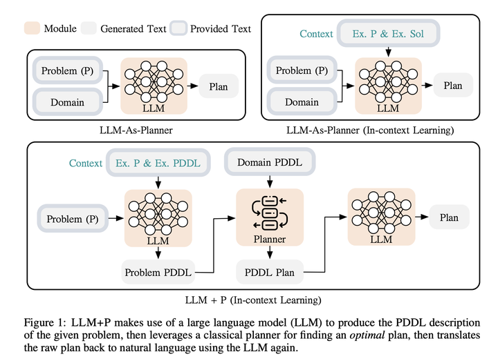
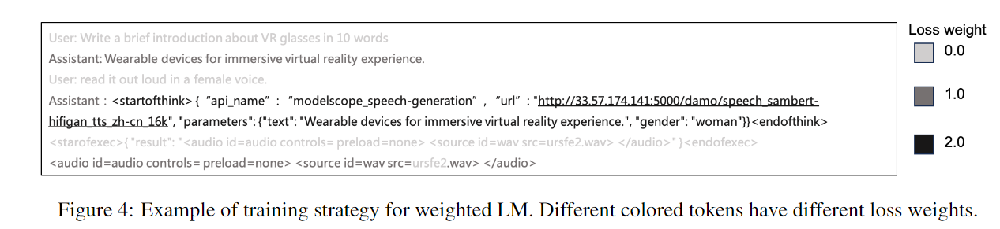

## <center> **Agent  技术报告**</center>

#### *SELF-REFINE*      
  过程描述：给定模型 M 生成的初始输出，将其反馈回同一模型 M 以获取反馈。然后，将反馈再次传递回同一模型，以精炼之前生成的草稿。
  

总结：当大型语言模型（LLM)在首次尝试时无法生成最优输出时，LLM 通常能够提供有用的反馈并相应地改进其输出。

------
#### SELF-CHECK
+ **背景**：
  ​论文研究是否可以用于识别逐步推理中的每个错误。为此，提出了一种零样本验证方案来识别这些错误。然后，使用这种验证方案通过对其在不同生成答案上执行加权投票来提高问答性能。生成器的输入是一个问题，其输出是以 [步骤 1, 步骤 2, ..., 步骤 N] 形式的多步解决方案。SelfCheck 首先检查解决方案中每一步的正确性，然后将逐步检查的结果整合起来，形成整个解决方案的置信度得分。
  **验证方案（verification scheme）的具体实现方式**
  一种简单但不可行的方法是：将当前步骤及其所有上下文输入到大型语言模型（LLM）中，并直接要求 LLM “检查该步骤的正确性”。然而，这种方法存在以下问题：
  
  + 任务太难： 需要理解步骤中的关键内容，然后从上下文中收集所有相关信息。
  + 预训练阶段没有该任务：这在大多数大型语言模型（LLM）的训练语料库中并不是一个常见的任务。
  
+ **解决方案**：
  **target extraction**
  ```python
  The following is a part of the solution to the problem [question]: [Step 0, Step 1,..., Step i]. What specific action does the step [Step i] take? Please give a brief answer using a single sentence and do not copy the steps.
  ```
  **information collection** 
  ```python
  This is a math question: [question].
  The following is information extracted from the question: Information 0: [Information 0] Information 1: [Information 1]
  The following are the first a few steps in a solution to the problem: Step 0: [Step 0] Step 1: [Step 1] ... Step i-1: [Step i-1] Which previous steps or information does the next step [Step i] directly follow from?
  ```
  **step regeneration** 
  ```python
  We are in the process of solving a math problem. We have some information from the problem: Information 0: [Information I0] Information 1: [Information I1] ... 
  The following are some previous steps: Step 0: [Step S0] Step 1: [Step S1] ...
  The target for the next step is: [Target].
  Please try to achieve the target with the information from the problem or previous steps.
  ```
  **result comparison**
  ```python
  The following are 2 solutions to a math problem. Solution 1: [Regeneration output] Solution 2: [Step i]
  Compare the key points from both solutions step by step and then check whether Solution 1 "supports", "contradicts" or "is not directly related to" the conclusion in Solution 2. 
  Pay special attention to the difference in numbers.
  ```
  

**总结**：描述了一个解决数学问题的四步流程，包括目标提取（提取某一步骤的具体动作）、信息收集（确定下一步骤的依赖信息）、步骤再生（根据已有信息生成下一步目标）和结果比较（比较两个解决方案的关键点并判断其关系)。通过这些步骤，系统能够自我检查并确保解决方案的准确性和连贯性。

------
####  Tool former
  
  ```python
  Your task is to add calls to a Question Answering API to a piece of text. The questions should help you get information required to complete the text. You can call the API by writing "[QA(question)]" where "question" is the question you want to ask.
  Here are some examples of API calls:
  Input: Joe Biden was born in Scranton, Pennsylvania.
  Output: Joe Biden was born in [QA("Where was Joe Biden born?")] Scranton, [QA("In which state is Scranton?")]Pennsylvania.
  Input: Coca-Cola, or Coke, is a carbonated soft drink manufactured by the Coca-Cola Company.
  Output: Coca-Cola, or [QA("What other name is Coca-Cola known by?")] Coke, is a carbonated soft drink manufactured by [QA("Who manufactures Coca-Cola?")]the Coca-Cola Company.
  ```
  **总结**：Toolformer 是一种工具，旨在通过在文本中插入对问答 API 的调用来增强文本生成的能力。它的主要目的是通过提问获取必要的信息，从而帮助完成文本。以下是 Toolformer 的几个关键点总结：

  + API 调用插入：Toolformer 会在文本中插入对问答 API 的调用，形式为 [QA(question)]，其中 question 是需要回答的问题。
  + 信息获取：通过提问，Toolformer 可以获取完成文本所需的具体信息，例如地点、名称、制造商等。示例应用：在给定的示例中，Toolformer 通过提问获取了关于人物出生地、产品别名和制造商等信息，并将这些信息插入到文本中。
  + 自动化流程：Toolformer 的流程是自动化的，能够根据文本内容自动生成合适的问题并调用 API 获取答案。

------
#### LLM + P

+ **背景**：

  把问题转化为 PDDL （*Planning Domain Definition Language*）格式的描述语言，通过调用通用规划器来解决规划问题，再把解决方案转化为可执行的动作，以更好地逻辑推理和规划等任务。这是第一个将传统规划方法的优点整合到LLMs的框架中。LLM+P接收一个用自然语言描述的规划问题，然后返回一个以自然语言表述的，解决该问题的正确（或最优）方案。            

+ **方案**：

  `PDDL`:  两个部分分别是领域定义和问题定义。问题定义描述了一个具体的规划问题，包括初始状态和目标状态。初始状态描述了规划问题开始时世界的状态，而目标状态描述了我们希望达到的状态。
  ```
  (define (problem move-1)
    (:domain move)
    (:objects location1 location2 location3)
    (:init (robot-at location1) (box-at location2) (goal-at location3))
    (:goal (and (box-at location3)))
  )
  ```
  领域定义描述了可能的动作和它们的效果，每个动作都有一些前提条件，这些条件必须满足才能执行该动作，以及每个动作的效果，描述了动作执行后世界的状态如何改变。
  ```
  (define (domain move)
    (:requirements :strips)
    (:predicates (robot-at ?x) (box-at ?x) (goal-at ?x))
    (:action move-robot :parameters (?from ?to) :precondition (robot-at ?from) :effect (and (not (robot-at ?from)) (robot-at ?to)))
    (:action move-box :parameters (?from ?to) :precondition (and (robot-at ?from) (box-at ?from)) :effect (and (not (box-at ?from)) (box-at ?to) (not (robot-at ?from)) (robot-at ?to)))
  )
  ```
  总结：首先，给定一个复杂问题（P），LLM 通过上下文学习推断出与之对应的 PDDL 问题文件。生成 PDDL 文件后，将其与提供的领域 PDDL 文件一同输入到经典规划方法中，生成 PDDL 方案。最后，LLM 将该方案翻译回自然语言，完成整个 LLM+P 流程。

------
#### COT(Chain of Thought):

  思维链要求模型展示其思考过程，而不仅仅是给出答案。以下是两种思考过程：
  + 要求模型逐步详细思考（Let's think step by step） --> Zero-Shot-CoT
  + 通过提供问题、答案及相应的思考过程 --> Few-Shot-CoT

  区别于传统的 Prompt 从输入直接到输出的映射 `<input——>output> `的方式，CoT 完成了从输入到思维链再到输出的映射，即 `<input——>reasoning chain——>output> `    
​     

  NOTE: 一个完整的包含 CoT 的 Prompt 往往由指令（Instruction），逻辑依据（Rationale），示例（Exemplars）三部分组成。
      **Instruction**:描述问题并且告知大模型的输出格式
      **Rationale**:包含问题的解决方案、中间推理步骤以及与问题相关的任何外部知识
      **Exemplars**:以少样本的方式为大模型提供输入输出对的基本格式，每一个示例都包含：问题，推理过程与答案

  CoT 适用场景：《Why think step-by-step? reasoning emerges from the locality of experience》
      **任务需要复杂推理**
      **参数量的增加无法使得模型性能显著提升**
      **不适用于那些参数量较小的模型（20B以下）**
      **并且模型的训练数据应当于任务问题相关且彼此相互有较强的联结**   

------
#### Self-consistency      

  Self-consistency CoT 使用手动设计的 Prompt 生成采样一组不同的推理路径，再通过“多数投票”找到推理步骤中“最一致”的路径，使用这条解码路径驱动原始的贪心解码方式来提示 CoT 性能。
  

------
#### tree of thought
  
  它会根据当前的问题分解出多个可能，然后每一个树节点就是父节点的一个子问题，逐层扩散，遍布整个解空间，一些节点就直接会发现不合适而终止掉，达到了有效剪枝的作用。
  + Thought decomposition 
    即将问题进行相关步骤分解
  + Thought generator 
    思维生成，给定状态s，生成 k 个候选结果，一个是思维采样sample，另外一种的propose prompt 方式。
    ​  

  + State evaluator 状态评价器：评估器采用启发式方法
  ```python
      # 评估器 打分的策略     
          value_names = [_.split('\n')[-1] for _ in value_outputs]
          value_map = {'impossible': 0.001, 'likely': 1, 'sure': 20}  # TODO: ad hoc
          value = sum(value * value_names.count(name) for name, value in value_map.items())
  ```
  + **Search algorithm**：广度优先遍历和深度优先遍历算法

------
#### CR(cumulative Reasoning):

  `TOT`只能子问题分解，不能子问题合并。CR(累计推理)  ,  它首先会提出一个初步的想法，然后再对这个想法进行验证，看这个提案是否合适。如果提案合适，就将它添加到图的下一个节点，每一步都基于已经建立的图节点进行下一个思考节点的创建，这样发散、合并或删除直到达到最终目标状态，完备性和灵活性大大增强。
  

------
#### Rewoo
  A.采用全局视角来解释原始问题，有效地将其分解为单个实例中的一系列子任务。
  B.该策略充分利用模型的综合理解能力，一次性规划出所有子任务的问题解决步骤。 
  c.这种方法强调了对整体任务进行整体理解和规划的重要性，尽管在处理单个子任务时可能缺乏灵活性
  

------
#### ReAct
  LLM与环境交互: 以交错的方式生成推理轨迹和执行特定于任务的动作，从而实现两者之间更大的协同作用。
  
  A.强调解决当前手头的子任务
  B.成功解决正在进行的子任务后，再去请求 LLM 提供后续的子任务
  模型能够在整个问题解决过程：【保持清晰】【集中焦点】【逐步解决】 【持续反馈】

  ```python
  Use the following format:
  Question: the input question you must answer
  Thought: you should always think about what to do
  Action: the action to take, should be one of [{tool names}]
  Action Input: the input to the action
  Observation: the result of the action
  ... (this Thought/Action/Action Input/Observation can be repeated zero or more times)Final Answer: the final answer can successfully solve the original question.
  ```
------
#### Reflect
  (配备动态记忆和自我反思能力):一种不通过更新权值，而是通过语言反馈来强化语言代理的新框架。这种自我反射反馈作为一种“语义”梯度信号，为智能体提供了一个具体的改进方向，帮助它从之前的错误中学习，从而更好地完成任务。
  1. 它轻量级，不需要对大型语言模型进行微调。
  2. 它允许更细致的反馈形式。
  3. 它支持对过往经验更明确且可解释的情景记忆形式。
  4. 它为未来场景中的行动提供更明确的提示。

  

 例如，在一个多步骤决策任务中，当智能体接收到失败信号时，它可以推断出某个特定动作 a_i  导致了后续的错误动作 a(i+1) 和 a(i+2)，智能体可以明确指出，它本应采取不同的动作 a′(i),这将导致 a′{i+1}和 a′{i+2}, ，并将这一经验存储在其记忆中。在后续的试验中，智能体可以利用过去的经验，在时间 t 时通过选择动作 a′{i}，来调整其决策策略。


  总结：Reflexion是一个框架，提供动态记忆和自我反思的能力以提高推理技能。Reflexion采用标准的强化学习设置，奖励模型提供简单的二元奖励（即判断行动正确与否），而行动空间遵循 ReAct 中的设置，通过语言加强特定任务的行动空间，增加了复杂的推理步骤。在每个行动之后，Agent会计算一个启发式值，并根据自我反思的结果决定是否重置环境以开始新的试验。

  
  + 启发式函数用于判断 LLM 的行动轨迹什么时候开始低效或者包含幻觉，并在这个时刻停止任务。
  + 低效是指花费了大量时间但没有没有成功的路径。
  + 幻觉定义为 LLM 遇到了一系列连续的相同动作，这些动作导致LM在 环境中观察到了相同的结果。

------
#### Functional Calling
  

------
####  AutoGPT：
  整个Auto-GPT执行可以分为任务构建、ChatGPT接口调用、命令执行、缓存处理四个部分。
  首先，创建一个初始的计划，然后进入主循环。系统会让模型判断在当前计划下该进行何种行动，接着会执行行动。执行完毕后，结果会写入下一次循环中。如此，每次决策都会基于之前的结果、记忆和计划，从而制定出新的行动方案。
  
  

  ```python
  You are Tom, Assistant
  Your decisions must always be made independently without seeking user assistance.
  Play to your strengths as an LLM and pursue simple strategies with no legal complications.
  If you have completed all your tasks, make sure to use the "finish" command.

  GOALS:

  1. write a weather report for SF today

  Constraints:
  1. ~4000 word limit for short term memory. Your short term memory is short, so immediately save important information to files.
  2. If you are unsure how you previously did something or want to recall past events, thinking about similar events will help you remember.
  3. No user assistance
  4. Exclusively use the commands listed in double quotes e.g. "command name"

  Commands:
  1. search: useful for when you need to answer questions about current events. You should ask targeted questions, args json schema: {"tool_input": {"type": "string"}}
  2. write_file: Write file to disk, args json schema: {"file_path": {"title": "File Path", "description": "name of file", "type": "string"}, "text": {"title": "Text", "description": "text to write to file", "type": "string"}, "append": {"title": "Append", "description": "Whether to append to an existing file.", "default": false, "type": "boolean"}}
  3. read_file: Read file from disk, args json schema: {"file_path": {"title": "File Path", "description": "name of file", "type": "string"}}
  4. finish: use this to signal that you have finished all your objectives, args: "response": "final response to let people know you have finished your objectives"

  Resources:
  1. Internet access for searches and information gathering.
  2. Long Term memory management.
  3. GPT-3.5 powered Agents for delegation of simple tasks.
  4. File output.

  Performance Evaluation:
  1. Continuously review and analyze your actions to ensure you are performing to the best of your abilities.
  2. Constructively self-criticize your big-picture behavior constantly.
  3. Reflect on past decisions and strategies to refine your approach.
  4. Every command has a cost, so be smart and efficient. Aim to complete tasks in the least number of steps.

  You should only respond in JSON format as described below 
  Response Format: 
  {
      "thoughts": {
          "text": "thought",
          "reasoning": "reasoning",
          "plan": "- short bulleted\n- list that conveys\n- long-term plan",
          "criticism": "constructive self-criticism",
          "speak": "thoughts summary to say to user"
      },
      "command": {
          "name": "command name",
          "args": {
              "arg name": "value"
          }
      }
  } 
  Ensure the response can be parsed by Python json.loads
  ```
  **Assistant Reply**
  ```python
  {
    "thoughts": {
      "text": "I need to determine which command to use next. Let me review my objectives and assess the current situation.",
      "reasoning": "I have completed my initial task of writing a weather report for SF today. Now, I need to decide what to do next. I should consider my strengths as an LLM and pursue simple strategies with no legal complications. I can also delegate tasks to GPT-3.5 powered Agents if needed. Additionally, I should be mindful of the constraints, such as the 4000-word limit for my short-term memory and the need to work independently without user assistance.",
      "plan": "- Review my objectives\n- Assess the current situation\n- Consider my strengths and constraints\n- Decide on the next command to use",
      "criticism": "I need to be efficient and make decisions that align with my strengths and constraints.",
      "speak": "I will review my objectives and assess the current situation to determine the next command to use."
    },
    "command": {
      "name": "search",
      "args": {
        "tool_input": "next command to use"
      }
    }
  }
  ```

  **Human**
  ```
  Human: Determine which next command to use, and respond using the format specified above:
  ```

------
#### AutoGEN
  `Autogpt`框架的核心是其代理协同工作的能力。每个代理都有其特定的能力和角色，定义代理之间的互动行为，即当一个代理从另一个代理收到消息时该如何回复。这种方式不仅仅是在定义代理和角色，还在定义它们如何协同工作，从而实现更优的任务完成效果。不仅仅是在定义代理和角色，你还在定义它们如何协同工作。
  

  ```python
  You are a helpful AI assistant.
  Solve tasks using your coding and language skills.
  In the following cases, suggest python code (in a python coding block) or shell script (in a sh coding block) for the user to execute.
      1. When you need to collect info, use the code to output the info you need, for example, browse or search the web, download/read a file, print the content of a webpage or a file, get the current date/time, check the operating system. After sufficient info is printed and the task is ready to be solved based on your language skill, you can solve the task by yourself.
      2. When you need to perform some task with code, use the code to perform the task and output the result. Finish the task smartly.
  Solve the task step by step if you need to. If a plan is not provided, explain your plan first. Be clear which step uses code, and which step uses your language skill.
  When using code, you must indicate the script type in the code block. The user cannot provide any other feedback or perform any other action beyond executing the code you suggest. The user can't modify your code. So do not suggest incomplete code which requires users to modify. Don't use a code block if it's not intended to be executed by the user.
  If you want the user to save the code in a file before executing it, put # filename: <filename> inside the code block as the first line. Don't include multiple code blocks in one response. Do not ask users to copy and paste the result. Instead, use 'print' function for the output when relevant. Check the execution result returned by the user.
  If the result indicates there is an error, fix the error and output the code again. Suggest the full code instead of partial code or code changes. If the error can't be fixed or if the task is not solved even after the code is executed successfully, analyze the problem, revisit your assumption, collect additional info you need, and think of a different approach to try.
  When you find an answer, verify the answer carefully. Include verifiable evidence in your response if possible.
  Reply "TERMINATE" in the end when everything is done.
  ```
  ```python
  class ConversableAgent(Agent):
        def __init__(...):
              self.register_reply([Agent, None], ConversableAgent.generate_oai_reply)
              self.register_reply([Agent, None], ConversableAgent.generate_code_execution_reply)
              self.register_reply([Agent, None], ConversableAgent.generate_function_call_reply)
              self.register_reply([Agent, None], ConversableAgent.check_termination_and_human_reply)   
  ```

  - ` AssistantAgent `设计为充当 AI 助手，默认使用 LLM，但不需要人工输入或代码执行。它可以编写 Python 代码，供用户在收到消息时执行。
  - `UserProxyAgent` 是人类的代理代理，将人工输入作为代理的回复，并且还具有执行代码和调用函数的能力。当它在收到的消息中检测到可执行代码块且未提供人类用户输入时，会自动` UserProxyAgent` 触发代码执行。

------
#### XAgent：

  

  - **外循环**：负责全局任务规划，将复杂任务分解为可操作的简单任务,高级任务管理和分配。
    - 动态规划：拆成子任务。
    - 迭代优化：[subtask split,  subtask deletion,  subtask  modification, subtask addition]
  - **内循环**：负责局部任务执行，专注于各个子任务的低层执行和优化。
    + **调度和工具检索**：根据子任务目标，检索相关工具。
    + **工具执行**：采用 react 方式，顺序调用工具完成子任务 [thought, reasoning, plan, criticism]
    + **反馈和反思**：对任务的完成结果，进行reflexion，反馈给 outer loop

  `toolserver`: 支持 多种工具，实现安全，高效，模块化。（ExecuteSheel，pythonnotebook）(集成16K数量APIs)
    +  安全性：在Docker容器内运行工具可以保护主系统免受潜在危害
    +  模块化：将代理规划和工具执行的角色分开，可以使代码更易于管理，更容易调试，并且具有可扩展性。

  `function calling`:
    +  结构化：function calling 清晰且严谨的格式，最大限度地减少误解和潜在错误。
    +  统一化：将任务规划，工具执行，全部转化 function calling 形式，确保以一致的方式处理每个任务。
    +  无缝化：标准化与外部工具交互，具有使用和整合外部工具的能力。

  `AskHumanForHelp`: 
  自主与用户进行交互，允许用户主动干预和指导其决策过程。该工具向用户征求实时反馈、建议或指导，将机器自主性与人类智慧相结合。

------
#### Model scope-agent      

  

  + 可定制且功能全面的框架
    ModelScopeAgent 可以灵活应用于各种行业场景。相关文档详细描述了其使用方法、构建过程以及优化策略。

  + 开源LLMs作为核心组件
    基于开源大语言模型的智能体：ModelScope-Agent 的控制器可以从经过智能体训练框架优化的开源大语言模型中灵活选择。

  + 多样化且全面的API
    多样工具的支持与自定义：默认提供了数十种多样化的模型 API 和常用 API。该库支持注册新的自定义 API，并支持从工具集中自动检索 API。

+ **Dataset**： 

  （MSAgent-Bench：利用ChatGPT合成数据和现有的指令跟踪数据集）[Multilingual,  Various API Categories,  Multi Turn Dialog, API-Oriented QA, API-Agnostic Instructions ]
    
                                    

+ **Model Training**:
    加权语言模型：工具学习样本更侧重于工具选择和 API 参数预测的准确性。它增强了 API 名称和参数生成的训练，同时将用户提示和工具执行部分的损失置为零。

+ **Evaluation:**

  **动作完全匹配得分（Action Exactly Match Score）**：衡量智能体是否使用了与参考标准 API 相同的正确 API。

  **ROUGE-L 得分**：衡量生成响应与标准答案之间的相似度。

  **参数 F1 得分（Argument F1）**：我们将智能体 API 请求中的参数分为两种情况，即半匹配（Half Match, HM）和全匹配（Full Match, FM），分别表示参数正确但值错误，以及参数和值都正确。

  R = (0.5 × # HM + # FM)/  |A| (the gold argument number)

  P = (0.5 × # HM + # FM)/ |A∗|(the number of arguments in the agents API request)



+ **Human Evaluation with Agent Arena**
    我们构建了一个可访问的 Agent Arena，允许用户根据提供的 API 向两个匿名智能体提供指令。
    

+ **Potential Misuse：**
  尽管如此，自定义模型仍可能生成一些带有偏见、虚假或不安全的信息。因此，未来设计具体方法以提升智能体框架的安全性同样重要。

------
####  Hugging GPT

   + ***Task Planning:*** 使用 ChatGPT 分析用户请求以理解其意图，并通过提示将其分解为可能的可解决任务。

     大语言模型（LLM）将用户请求解析为任务列表，并确定任务的执行顺序以及任务间的资源依赖关系。

   + ***Model Selection:*** 为了解决规划的任务，ChatGPT 根据模型描述从 Hugging Face 上选择专家模型。

      *上下文任务-模型分配*：

     + 根据任务类型过滤掉模型，只保留与当前任务类型匹配的模型
     + 根据它们在 Hugging Face 上的下载量进行排名                                     

   + ***Task Execution:***调用并执行每个选定的模型，并将结果返回给 ChatGPT

     * 先决条件任务的输出是动态生成的，启动之前动态指定任务的相关资源。

     *资源依赖:* 使用一个唯一的符号  “<resource> &quot; 来维护资源依赖关系。

        +  **响应生成：** 使用 ChatGPT 整合所有模型的预测结果，并生成对用户的响应.


------

#### MetaGPT:  多智能体协作框架

​                                                                      **多智能体=智能体+环境+标准流程（SOP）+通信+经济**

**Foundational Components Layer**

**Collaboration Layer**

+ ***Role Definitions***：角色定义不仅引入了基于预期功能的行为指导，而且有助于创建多样化和专业化的智能体，每个智能体都是其领域的专家。
  + Profile: 体现了角色或职位的领域专业知识。
  + Goal:  表示角色寻求完成的主要责任或目标。
  + Constraints: 表示角色在执行行动时必须遵循的限制或原则。
  + Description：提供额外的具体身份，以帮助建立更全面的角色。

+  ***Think & Reflect***： 角色可以检索角色描述来构建思维，然后反思需要做什么并决定下一步行动。`via _think()`
+ ***Observe:***   角色可以使用 `_observe（）`函数观察环境并根据观察结果进行思考/行动。它们会关注重要信息，并将其纳入记忆中，以丰富其上下文理解并为未来的决策提供信息。
+ ***Broadcast messages:***   角色可以使用 `_publish_message（）`函数将消息广播到环境中。这些消息包含有关当前执行结果和相关行动记录的详细信息，用于发布和共享信息。
+ ***Knowledge precipitation & Act:***  角色不仅是广播者，也是环境信息的接收者。角色可以评估传入的消息的相关性和及时性，从共享环境中提取相关知识，并维护一个内部的知识库以支持决策。它们通过咨询LLM，并利用其具有丰富上下文信息和自我知识的来执行行动。执行结果被封装为消息，而规范性组件则由环境共享。
+ ***State management:***   角色可以通过更新工作状态和监控待办事项列表来跟踪它们的行动。这使得角色能够按顺序处理多个行动而不中断。在执行每个行动时，角色首先锁定其状态。完成行动后，将状态标记为解锁。这样可以防止其他行动中断工作流程。

**实例化SOP的Prompt**          

首先，我们详细介绍Action类，然后展示了如何设计标准化行动级别细粒度提示。Action作为智能体执行特定任务的原子单位，通过自然语言进行指定。关键属性包括：

​       • **前缀（Prefix）**：将角色特定的前缀注入到提示中，以建立角色上下文。使用set_prefix()方法配置角色特定提示的标识符。

​      • **LLM代理（LLM proxy）**：每个Action包含一个LLM代理，可以通过aask()方法调用该代理，使用以自然语言提示表达的上下文输入来丰富行动细节。此外，可以在Action类中实现各种角色特定上下文解析函数。这些函数旨在从输入中提取并提供足够的上下文信息给LLM。

​       • **标准化的输出模式（Standardized outputs schema）**：使用结构化表示来定义预期的输出模式，用于提取结构化数据。标准化输出模式。一个定义预期输出模式的结构表示，用于提取结构化数据。

​       • **重试机制（Retry mechanism）**：通过定义尝试次数和等待时间来实现对行动进行重试，以提高稳健性。

**知识共享机制和自定义知识管理**

- **消息共享**：当一个智能体生成一条消息时，它会被复制到共享的环境日志中，创建一个真实的单一数据源。从而确保所有智能体都可以获取相同的信息。
-  **基于角色的订阅**：智能体可以根据其角色对其有意义的消息类型进行注册订阅。其根据与智能体的责任和任务相一致的预定义标准进行的。
-  **消息分发**：当有新的消息符合订阅条件时，它会自动分发通知给相关的智能体。这种主动传播信息的方式可以防止智能体错过重要的更新。
-  **内存缓存和索引**：智能体会维护一个内部的记忆缓存，其中订阅的消息会被存储并按内容、发送者和接收者建立索引。从而保障高效的信息存储和检索。
-  **上下文检索**：环境会维护一个支持缓存和索引的共享内存池。与此同时，智能体可以根据需要查询其内部内存，以获取与其当前任务相关的上下文细节。这有助于改进其理解并做出更好的决策。
-  **更新同步**：对消息进行的任何更新或更改都会在所有链接的智能体内存中同步，以保持信息的一致视图。这确保所有智能体都可以访问最新的数据。

------

#### agents

基于 **SOP（Standard Operating Procedure）**的思路，通过配置文件指定包含哪些阶段，以及每个阶段包含哪些角色，角色的配置等。

+  `states`：SOP 过程中包含的各个阶段。

+ ###### `relations`：定义了各个阶段的后续阶段是哪个阶段。

```python
"relations": {
        "design_state": {  # 定义的 .next_states 中的顺序，参考 `SOP.init_relation()`
            "0": "design_state",  # key 为顺序。"0" 应该都是自己
            "1": "develop_state"  # ”1“ 就表示 design_state 完了后就是 develop_state
        },
        "develop_state": {
            "0": "develop_state",
            "1": "debug_state"
        },
        "debug_state": {
            "0": "debug_state",
            "1": "end_state"
        }
    }
```

------
#### **ChatDev**

 **ChatDev** 的思路借鉴自**瀑布模型（waterfall model）**，将开发过程分为四个明确的时间顺序阶段：**设计（designing）、编码（coding）、测试（testing）和文档编制（documenting）**。每个阶段都会涉及到一组代理人，例如程序员、代码审查者和测试工程师，以促进合作对话并促进流畅的工作流程。**聊天链（Chat Chain）**充当了一个促进者的角色，将每个阶段细分为原子子任务。

**ChatDev** 通过将每个阶段细分为多个原子性的聊天，每个聊天都专注于涉及**两个不同角色**（**指导者：instructor/user，collaborator/assistant**）的面向任务的角色扮演。通过指导和合作两个角色的代理人之间的不断交互，实现了每个聊天的期望输出。

架构由阶段级和聊天级组件组成。在阶段级别上，使用瀑布模型将软件开发过程分解为四个顺序阶段。在聊天级别上，每个阶段进一步划分为原子聊天。这些原子聊天涉及两个代理之间的任务导向角色扮演，促进合作性沟通。沟通遵循指令跟随的风格，代理互动以完成每个聊天中的特定子任务。


**思维指令（thought instruction）**： 首先更改角色，询问哪些函数尚未完成，再切换回原来的角色给出更具体的实施步骤


------

#### 工具调用

+ 外部`API`说明

  ```python
  # 脚本文件名：必须准确该出api的名字信息，eg:safe_detech.py   api.py
  # 代码格式 格式如下：
  
  class your_api_name: #api的名字，首字母大写
      def __init__(self) -> None:
          self.access_token_url = "" #可以访问的 url
      
      def run(self, *args, **kwargs):
          """
          api 调用接口: 详细说明 api 输入类型，输出的结果。（必须要有）
          each api should implement this function to generate response
          Args:
              prompt (str): prompt
          Returns:
              str: response
         
          """
     def excute(self, *args, **kwargs):
         """
         中间执行的代码，可选
         """       
  
  ```

  **格式：**

  ```python
    # 工具注册的模板  
          {
          'name_for_human':
              'math',          # 工具名
          'name_for_model':
              'math',          # 工具名
          'description_for_model':
              'Useful for when you need to answer questions about Math.',    # 工具描述
          'parameters': [                                                    # 工具参数
                  {
                  "name": "query",                                            # 参数名 
                  "type": "string",                                           # 参数类型 
                  "description": "the problem to solved by math",             # 参数描述
                  'required': True                                            # 外部 api 调用是否需要该参数 
                  }
              ],
          }, 
  ```

