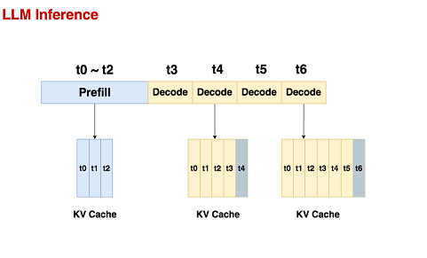
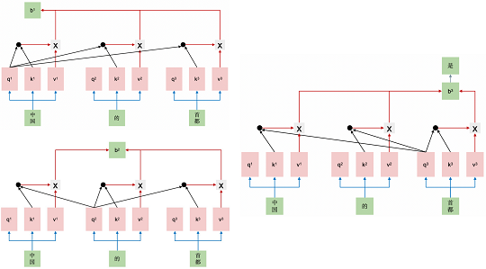
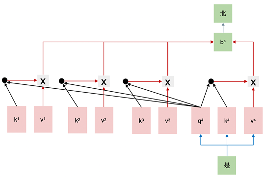
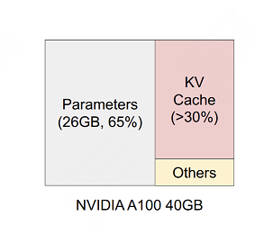

#                               **kv cache**

+ ### 背景：

  `causalLM` 模型采用自回归（`auto_regressive`）的方法，在推理过程通常分为两个阶段：**prefill和decode**。**通常会使用KV cache技术存储已完成计算的信息(每层每头k，v), 加速推理**。

  

  + **Prefill**:

    **预填充阶段**: 把整段`prompt`喂给模型做`forward`计算。如果采用`KV cache`技术，这个阶段中会把`prompt `过 $ W_k $，$W_v$  后得到的$X_k$，$X_v$​ 保存在**cache_k和cache_v**中，这样在对后面的 `token` 计算 `attention` 时，我们就不需要对前面的 `token` 重复计算$X_k$，$X_v$，大幅度节省推理时间。

    

    

  + **Decode：**

    在这个阶段中，**根据prompt的prefill结果，一个token一个token地生成response。**同样，如果采用了`KV cache`，则每走完一个`decode`过程，我们就把对应`response token`的KV值存入`cache`中，以便能加速计算。

    **由于`Decode`阶段的是逐一生成`token`的，因此它不能像prefill阶段那样能做大段`prompt`的并行计算，所以在LLM推理过程中，Decode阶段的耗时一般是更大的。**

    

    设输入序列的长度为 $s$ ，输出序列的长度为$ n$ ，模型深度为$l$，维度为$h$,以 FP16 来保存KV cache，那么KV cache的峰值显存占用大小为 $b(s+n)h∗l∗2∗2=4blh(s+n)$ 。
    
    模型越大，KV cache所消耗显存就越大。由于LLM推理速度是由`计算flops`，`显存、带宽` 共同决定的，即有计算和通信时间组成。如果能压缩`kv_cache`, 减轻负载压力(GPU显存传输片上RAM)，能提升推理速度，并同时可以处理更多batch，增加吞吐量。
    
    
    
    从上述过程中，我们可以发现使用KV cache做推理时的一些特点：
    
    - **随着prompt数量变多和序列变长，KV cache也变大，对gpu显存造成压力**
    - **由于输出的序列长度无法预先知道，很难提前为KV cache量身定制存储空间,见vLLM**

  ******

+ ### 内存管理：

  下图展示了一个13B的模型在 A100 40GB 的 gpu上做推理时的显存占用分配，others表示forward过程中产生的激活值(activation）的大小。

  

  + **方式1：量化参数**

    主流两种量化：后训练量化(PTQ)和量化感知训练(QAT)， 前者代表作：`GPTQ`, `AWQ`, 后者代表作`QLORA`,  本文不聚焦。

  + **方式2：优化KV**

    调整模型结构压缩`kv_cache` 缓存，提高推理吞吐量。


+ ### kv cache

  + **工程上优化**: **vLLM通过 PagedAttention 的技术，动态地为请求分配KV cache显存，提升显存利用率。**

  + **`MHA` 方法**：

    + **数学分析**：

      假设输入$X$ 的维度是$[b,s,h]$,  假定$h$ 长度设定为 2048. 参数权重 $W$

      step1： 获取`Q`,`K`,`V` 矩阵：
      $$
      [Q,K,V] = X * W^T  \\
      [b,s,h] * [h,3h] = [b,s,3h]
      $$
      step2:  切头操作，维度变换。
    
      ​           `num_heads` 设置 16 , `head_dim` 则为 128. 对应维度信息如下：
      $$
      Q : [b,num_{-}heads,s,head_{-}dim] \\
      K^T:[b,num_{-}heads,head_{-}dim,s] \\
      S : Q * K^T = [b,num_{-}heads,s,s]
      $$
    
    + **代码**
    
      ```python
      query, key, value = self.c_attn(hidden_states).split(self.split_size, dim=2)
      query = self._split_heads(query, self.num_heads, self.head_dim)  # 当前token对应的query
      key = self._split_heads(key, self.num_heads, self.head_dim)  # 当前token对应的key
      value = self._split_heads(value, self.num_heads, self.head_dim)  # 当前token对应的value
      
      if layer_past is not None:
          past_key, past_value = layer_past  # KV Cache
          key = torch.cat((past_key, key), dim=-2)  # 将当前token的key与历史的K拼接
          value = torch.cat((past_value, value), dim=-2)  # 将当前token的value与历史的V拼接
      
      if use_cache is True: 
          present = (key, value)     
      else:
          present = None
      ```
    
      入参口：
    
      ```python
      transformer_outputs = self.transformer(
                  input_ids,
                  past_key_values=past_key_values,
                  attention_mask=attention_mask,
                  token_type_ids=token_type_ids,
                  **kwargs)
      ```
    
       kv_cache 以元组的形式，通过  `past_key_values` 字段传递。假设将原始输入进行线性变化（`MLP`）后，将转化结果保存在 `past_key_values`里 , 便是（`P-tuning V2`，`Prefix_tuning`）.

  + **`MQA`方法**：

     设$[b,s,h=2048]$，而`MQA`实现 `k`,`v` 共享机制，及投影矩阵$W$ 维度发生变化。
    $$
    [Q,K,V] = X * W^T  \\
    [b,s,h] * [h, h + head_{-}dim + head_{-}dim] = [b,s,h + 2* (h/num_{-}heads)] \\
    Q : [b,16,s,128] \\
    K^T:[b,1,128,s] \\
    $$
    在计算注意力机制中，先对$K^T$ 做广播，即将一个头的 $K$ 多复制 $num_{-}heads$ 块。 
    $$
    S : Q * K^T = [b,16,s,s]
    $$
    注意到MQA由于共享了K、V，将会导致Attention的参数量减少了将近一半，而为了模型总参数量的不变，通常会相应地增大FFN/GLU的规模，这也能弥补一部分效果损失。

    
    $$
    o_t=[o^{(1)}_t,o^{(2)}_t,⋯,o^{(h)}_t]  \\
    o^{(s)}_t=Attention(q^{(s)}_t,k_{≤t},v_{≤t}) \\
    ≜\frac{∑_{i≤t}exp(q^{(s)}_tk_i^⊤)v_i}{∑_{i≤t}exp(q^{(s)}_tk_i^⊤)}   \\
    q^{(s)}_i=x_iW^{(s)}_q∈R^{d_k},W^{(s)}_q∈R^{d×d_k} \\
    k^{(s)}_i=x_iW^{(s)}_k∈R^{d_k},W^{(s)}_k∈R^{d×d_k} \\
    v^{(s)}_i=x_iW^{(s)}_v∈R^{d_v},W^{(s)}_v∈R^{d×d_v}
    $$
  
+ **`GQA` 方法:** 
  
  GQA的思想也很朴素，它就是将所有Head分为$g$个组（$g$可以整除$ℎ$），每组共享同一对K、V，用数学公式表示为:
  $$
  o_t=[o^{(1)}_t,o^{(2)}_t,⋯,o^{(h)}_t]  \\
    o^{(s)}_t=Attention(q^{(s)}_t,k_{≤t}^{([sg/h])},v_{≤t}^{([sg/h])}) \\
    ≜\frac{∑_{i≤t}exp(q^{(s)}_tk_{i}^{([sg/h])_T})v_i^{([sg/h])}}{∑_{i≤t}exp(q^{(s)}_tk_i^{([sg/h])_T})}   \\
    q^{(s)}_i=x_iW^{(s)}_q∈R^{d_k},W^{(s)}_q∈R^{d×d_k} \\
    k^{([sg/h])}_i=x_iW^{([sg/h])}_k∈R^{d_k},W^{([sg/h])}_k∈R^{d×d_k} \\
    v^{([sg/h])}_i=x_iW^{([sg/h])}_v∈R^{d_v},W^{([sg/h])}_v∈R^{d×d_v}
  $$
  
  
  `GQA`是`MHA`到`MQA`的自然过渡，当`g=h`时就是`MHA`，`g=1`时就是MQA，当`1<g<h`时，它只将KV Cache压缩到 `g/h`，压缩率不如`MQA`，但同时也提供了更大的自由度，效果上更有保证。
  
+ **`MLA`方法：**
  
  首先分析`GQA`在投影后做什么？首先它将向量对半分为两份分别作为K、V，然后每一份又均分为  𝑔 份，每一份复制 ℎ/𝑔 次，以此来“凑”够 h 个Attention Head所需要的K、V。  由于分割、复制都是简单的线性变换，所以`MLA`的想法是将这些简单的线性变换换成一般的线性变换，以增强模型的能力。即：通过不同的投影矩阵再次让所有的K、V Head都变得各不相同。
  $$
  o_t=[o^{(1)}_t,o^{(2)}_t,⋯,o^{(h)}_t]  \\
    o^{(s)}_t=Attention(q^{(s)}_t,k^{(s)}_{≤t},v^{(s)}_{≤t}) \\
    ≜\frac{∑_{i≤t}exp(q^{(s)}_tk_i^{(s)_T})v_i^{(s)}}{∑_{i≤t}exp(q^{(s)}_tk_i^{(s)_T})}   \\
    q^{(s)}_i=x_iW^{(s)}_q∈R^{d_k},W^{(s)}_q∈R^{d×d_k} \\
    k^{(s)}_i=c_iW^{(s)}_k∈R^{d_k},W^{(s)}_k∈R^{d_c×d_k} \\
    v^{(s)}_i=c_iW^{(s)}_v∈R^{d_v},W^{(s)}_v∈R^{d_c×d_v} \\
    c_i=x_iW_c∈R^{d_c},W_c∈R^{d×d_c}
  $$
  
  

**技巧1**: **恒等变化**
$$
q_i^{(s)} * k_i^{(s)T} =   (x_tW^{(s)}_q)(c_iW^{(s)}_k)^⊤=x_t(W^{(s)}_q.W^{(s)T}_{k})c^⊤_i
$$
  即$W_k$ 被 $W_q$ 吸入，同理$W_v$ 被 $W_o$ 吸入。也就是说此时KV Cache只需要存下所有的$c_i$就行，而不至于存下所有的$k_i^{(s)}$, $v_i^{(s)}$。 其实就是通过低秩分解，压缩KV Cache，通过不同的投影矩阵相当于增强了GQA的能力。

**缺点：**不兼容`RoPE` 旋转位置编码，矩阵乘法不满足交换律.
$$
  q^{(s)}_i=x_iW^{(s)}_q\mathbb{R}_i \\
  k^{(s)}_i=c_iW^{(s)}_k\mathbb{R}_i \\
  q^{(s)}_ik^{(s)_T}_j = (x_iW^{(s)}_q\mathbb{R}_i)(c_jW^{(s)}_k\mathbb{R}_j)^T = x_i(W^{(s)}_q\mathbb{R}_{i-j}k^{(s)_T})c_i^T
$$
  解决方案： **维度拼接**, 每个Attention Head的Q、K新增$𝑑𝑟$个维度用来添加RoPE，其中K新增的维度每个Head共享：

**query embbeding = [token_emb; pos_emb]**
$$
  o_t=[o^{(1)}_t,o^{(2)}_t,⋯,o^{(h)}_t]  \\
  o^{(s)}_t=Attention(q^{(s)}_t,k^{(s)}_{≤t},v^{(s)}_{≤t}) \\
  ≜\frac{∑_{i≤t}exp(q^{(s)}_tk_i^{(s)_T})v_i^{(s)}}{∑_{i≤t}exp(q^{(s)}_tk_i^{(s)_T})}   \\
  q^{(s)}_i=[x_iW^{(s)}_{qc},x_iW^{(s)}_{qr}\mathbb{R}_i]∈R^{d_k+d_r},W^{(s)}_{qc}∈R^{d×d_k}, W^{(s)}_{qr}∈R^{d×d_r}\\
  k^{(s)}_i=[x_iW^{(s)}_{kc},x_iW_{kr}\mathbb{R}_i]∈R^{d_k+d_r},W^{(s)}_{kc}∈R^{d×d_k}, W^{(s)}_{kr}∈R^{d×d_r} \\
  v^{(s)}_i=c_iW^{(s)}_v∈R^{d_v},W^{(s)}_v∈R^{d_c×d_v} \\
  c_i=x_iW_c∈R^{d_c},W_c∈R^{d×d_c}
$$

  


在推理时KV Cache只需要存$c_i$，新增的带RoPE的维度就可以用来补充位置信息，并且由于所有Head共享，所以也就只有在K Cache这里增加了$d_r$个维度。

推理阶段最终表现形式：
$$
  o_t=[o^{(1)}_tW_v^{(1)},o^{(2)}_tW_v^{(2)},⋯,o^{(h)}_tW_v^{(h)}]  \\
  o^{(s)}_t=Attention(q^{(s)}_t,k^{(s)}_{≤t},v^{(s)}_{≤t}) \\
  ≜\frac{∑_{i≤t}exp(q^{(s)}_tk_i^{(s)_T})v_i^{(s)}}{∑_{i≤t}exp(q^{(s)}_tk_i^{(s)_T})}   \\
  q^{(s)}_i=[c_i^{'}W^{(s)}_{qc}W^{(s)_T}_{kc},c_i^{'}W^{(s)}_{qr}\mathbb{R}_i]∈R^{d_c+d_r} \\
  k^{(s)}_i=[c_i,x_iW_{kr}\mathbb{R}_i]∈R^{d_c+d_r} \\
  
  W^{(s)}_{qc}∈R^{d_c^{'}×d_k},W^{(s)}_{kc}∈R^{d_c×d_k},W^{(s)}_{qr}∈R^{d_c^{'}×d_r},W_{kr}∈R^{d×d_r} \\
  
  c_i^{'}=x_iW_c^{'}∈R^{d_c^{'}},W_c∈R^{d×d_c^{'}} \\
  c_i=x_iW_c∈R^{d_c},W_c∈R^{d×d_c}
$$

  

  


​		


​       


