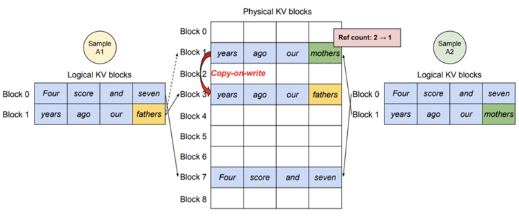

### **`vLLM`**

* #### **Question：**

  推理所生成的序列长度大小是无法事先预知的，大部分框架会按照(batch_size, max_seq_len)这样的固定尺寸，在gpu显存上预先为一条请求开辟一块连续的矩形存储空间。这样的分配方法很容易引起“gpu显存利用不足”的问题，进而影响模型推理时的吞吐量。

* #### **Solve:**

  通过 `PagedAttention` 的技术，按需分配，减少存储碎片, 动态地为请求分配KV cache显存，提升显存利用率。

* #### **Paged Attention**

  先总结 `虚拟内存分页管理` 的基本原理:

  1. 物理内存划分为固定大小的块，每一块为页(page)，物理内存中模拟出来的虚拟内存也按相同的方式做划分。

  2. 按需分配，动态加载数据到虚拟内存上，虚拟内存做好物理内存的映射。

  3. 通过模拟连续内存的方式，解决了物理内存上的碎片问题。

  **处理请求：**

  

  逻辑内存（logical KV blocks）可理解为操作系统中的虚拟内存，每个block类比于虚拟内存中的一个page。

  块表（block table）可理解为操作系统中的虚拟内存到物理内存的映射表，包含：

  + 逻辑块和物理块的映射关系（physical block number）
  + 每个物理块上被填满的槽位（# filled）：

  物理内存（physical KV blocks）可理解为操作系统中的物理内存(存在gpu显存)，每个block类比于虚拟内存中的一个page。

  流程：

  1. KV cache计算attention。当计算时，使用的是逻辑块，即形式上这些token都是连续的。与此同时，vLLM后台会通过block table这个映射关系，从物理块上获取数据做实际计算。通过这种方式，每个request都会认为自己在一个连续且充足的存储空间上操作，尽管物理上这些数据的存储并不是连续的。

  2. 基于新生成的词，更新逻辑块、物理块和block table。

  3. 分配新的逻辑块和物理块。逻辑块装满时，开辟新的逻辑块，并同时更新对应的block table和物理块。

* #### **Application：**

  + **Parallel Sampling**:
    

    假定我们发给模型1个request，这个request中包含2个prompt/sample，记为Sample A1和Sample A2，这两个prompt完全一致，都为 `Four score and seven years ago our` ，我们希望模型对这两个prompt分别做续写任务。

    （1）首先，Prefill阶段，vLLM拿到Sample A1和Sample A2，根据其中的文字内容，为其分配逻辑块和物理块。

    - **分配逻辑块**：对于A1，vLLM为其分配逻辑块block0和block1；对于A2，vLLM为其分配逻辑块block0和block1。需要注意的是，A1的逻辑块和A2的逻辑块是独立的，你可以将A1和A2视作操作系统中两个独立运行的进程。
    - **分配物理块**：对于A1和A2，虽然逻辑块独立，但因为它们的文字完全相同，所以可以**在物理内存上共享相同的空间**。所以A1的逻辑块block0/1分别指向物理块block7/1；A2的逻辑块block0/1分别指向物理块block7/1。我们设每个物理块下映射的逻辑块数量为ref count，所以对物理块block7/1来说，它们的ref count都为2。
    （2）然后，进入decode阶段，A1和A2各自做推理，得到第一个token，分别为fathers和mothers。

    - **将生成的token装入逻辑块**：对于A1和A2来说，将其生成的token装入各自的逻辑块block1。
    - **触发物理块copy-on-write机制**：由于fathers/mothers是两个完全不同的token，因此对物理块block1触发复制机制，即在物理内存上新开辟一块空间。此时物理块block1只和A2的逻辑块block1映射，将其ref count减去1；物理块block3只和A1的逻辑块block1映射，将其ref count设为1。

  +  **Beam Search**
    

    因为beam width = 4，这意味着根据beam search算法，在当前阶段我们生成了top 4个概率最大的token（记这4个token为beam candidate 0/1/2/3），它们分别装在block5，block6，block7和block8中。

    现在使用beam search算法做decoding，继续找出top 4个最可能的next token。假设这top 4 next token，有2个来自beam candidate 1，有2个来自beam candidate 2。因此在block6中引出block9和block10，用于装其中两个top 2 next token；对block7也是同理。

    现在，block9/10/11/12中装的top 4 next token，就成为新的beam candidates，可以按照和上述一样的方式继续做beam search算法。**而对于block5和block8，它们已经在beam search的搜索算法中被淘汰了，后续生成的token也不会和它们产生关系，所以可以清除掉这两个逻辑块，并释放它们对应的物理块的内存空间。**

    好，我们继续往左边来看这幅图。block3引出block5/6/7，block4引出block8，这意味着当前这4个top4 token，是上一个timestep下candidate1和candidate3相关序列生成的（candidate0和2的block没有画出，是因为它们所在的序列被beam search算法淘汰了，因此没有画出的必要）。**由于block8已经被淘汰，所以block4也相继被淘汰，并释放对应的物理内存空间。**

    **由此往左一路推，直到block0为止（block0代表着prompt，因此被beam seach中所有的序列共享）。这一路上，我们都根据最新时刻的beam search decoding结果，释放掉不再被需要的逻辑块和对应的物理内存空间，达到节省显存的目的。**

  
