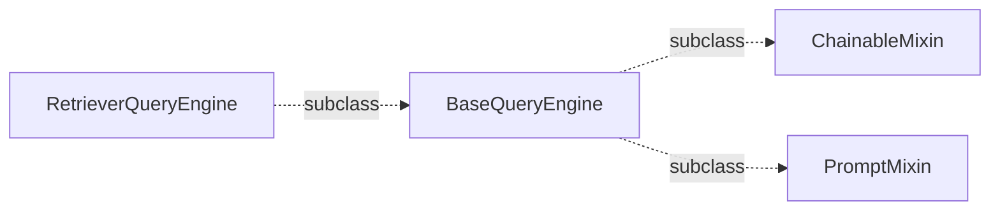

#### llama_index 代码解读

1. **加载数据**

   ```python
   from llama_index.core import SimpleDirectoryReader
   documents = SimpleDirectoryReader(input_dir=input_dir, input_files=input_files).load_data()
   ```

   ```mermaid
   flowchart LR
       subgraph document
       a[Document] --> id_
       a --> embedding
       a --> metadata
       metadata --> filename
       metadata --> filepath
       metadata --> file_type
       metadata --> file_size
       a --> relationships
       a --> text
       a -->  start_char_idx
       a --> end_char_idx
       a --> text_template
       a --> metadata_template   
       end
   ```

2. **将文档解析为节点**

   将  `Document`  对象解析为 `Node`  对象，节点表示源文档的“块” ， 还包含与其他节点和索引结构的元数据和关系信息。

   ```python
   from llama_index.core.node_parser import SentenceSplitter
   transformations = [SentenceSplitter(chunk_size = 512)]
   
   from llama_index.core.ingestion.pipeline import run_transformations
   nodes = run_transformations(documents, transformations=transformations)
   ```

   ```mermaid
   flowchart LR
       SentenceSplitter -.subclass
       .-> MetadataAwareTextSplitter
       MetadataAwareTextSplitter -.subclass
       .-> TextSplitter 
       TextSplitter  -.subclass
       .-> NodeParser -.subclass
       .-> TransformComponent -.subclass
       .-> BaseComponent
   ```

   **chunk** 策略：先切分，后合并。优先保持句子的完整性、短语完整，并尽量减少重叠。

   ```python
   splits = self._split(text, chunk_size)
   chunks = self._merge(splits, chunk_size)
   ```

   **拆分顺序如下：**

   1. 按段落分隔符分割
   2. 按块分词器分割（默认为nltk句子分词器）
   3. 按第二个块正则表达式分割（默认为$[^,\.;]+[,\.;]?$ ）
   4. 按默认分隔符（" "）分割

    `split_by_sep`    >      `split_by_sentence_tokenizer`   >  `split_by_regex`  >   `split_by_sep`  >  `split_by_char`

   统计分词后 `token` 数量，是否超过 `chunk_size`   ，若长句子分此后超过 `chunk_size` ,则递归式拆分；（  `tiktoken` 的 `bpe`）

   ```python
   from tiktoken import _tiktoken
   self._core_bpe = _tiktoken.CoreBPE(mergeable_ranks, special_tokens, pat_str)
   ```

   `pat_str` ： 正则表达式模式的字符串，用于分割输入文本； `mergeable_ranks`：如果一个文本处理函数需要在分割后合并某些标记，那么具有更高等级的标记将优先被合并。

   ```mermaid
   flowchart LR
       subgraph node
       a[TextNode] --> relationships
       a --> source_node
       a --> parent_node
       a --> prev_node
       a --> next_node
       end
   ```

3. **索引构建**

   ```python
   from llama_index.core import StorageContext, VectorStoreIndex
   index = VectorStoreIndex(
               nodes=nodes,
               embed_model=embed_model,
           )
   ```

   `LlamaIndex `支持  `HuggingFace` 嵌入模型，包括 BGE、Instructor 等, 使用参考如下：

   ```python
   %pip install llama-index-embeddings-huggingface
   from llama_index.embeddings.huggingface import HuggingFaceEmbedding
   embed_model = HuggingFaceEmbedding(model_name="BAAI/bge-small-en-v1.5")
   embeddings = embed_model.get_text_embedding("Hello World!")
   ```

   支持多种`Embedding`, 例如：`GeminiEmbedding`, `OllamaEmbedding` ,  `OpenAIEmbedding` ； 以  `OllamaEmbedding` 为例，使用教程参考如下：

   ```python
   %pip install  llama-index-embeddings-ollama==0.1.2
   from llama_index.embeddings.ollama import OllamaEmbedding
   # kwangs = {'base_url': 'http://127.0.0.1:11434', 'model_name': 'qwen2'}  # ollama 必要参数
   embed_model = OllamaEmbedding(**kwargs)
   embed_model.get_text_embedding('您是谁')
   ```

   接着介绍 `VectorStoreIndex `

   `VectorStoreIndex ` 不设置  `storage_context`  参数字段，会加载 默认的向量存储器` SimpleVectorStore`, 官方解释如下：

   ```python
   """
   Args:
      embedding_dict (Optional[dict]):    dict mapping node_ids to embeddings.
      text_id_to_ref_doc_id (Optional[dict]):  dict mapping text_ids/node_ids to ref_doc_ids.
       
   """
   ```

    若用户想用`fiass` 向量检索库，只需要传入`vector_store ` 对象, 参考如下：

   ```python
   from llama_index.vector_stores.faiss import FaissVectorStore
   import faiss
   from llama_index.core import StorageContext, VectorStoreIndex
   
   vector_store = FaissVectorStore(faiss_index=faiss.IndexFlatL2(config.dimensions))
                  SimpleVectorStore(
   storage_context = StorageContext.from_defaults(vector_store=vector_store)
   
   index = VectorStoreIndex(
       nodes = nodes,
       storage_context=storage_context,
       embed_model = embed_model ,
   )
   ```

   创建一个针对索引的问答引擎并提出一个简单的问题：

   ```python
   query_engine = index.as_query_engine(llm = llm)
   query_engine.query("how are you ?")
   ```

   查看下 `index`  类型 是 `BaseIndex`

   ```python
   from llama_index.core.indices.base import BaseIndex
   isinstance(index , BaseIndex)
   ```

4. **创建向量检索器：**

   使用默认的向量存储器：

   ```
   retriever = index.as_retriever()
   ```

   或者使用：

   ```python
   from llama_index.core.retrievers import VectorIndexRetriever
   # kwargs = {'similarity_top_k': 5, 'index': index, 'dimensions': 3584} # 必要参数
   retriever = VectorIndexRetriever(**kwargs)
   # 检索下效果
   await retriever.aretrieve('您好')
   ```

   **为方便在索引中插入后续节点，可以封装一层，更方便灵活使用 **

   ```python
   from llama_index.core.retrievers import VectorIndexRetriever
   from llama_index.core.schema import BaseNode
   class FAISSRetriever(VectorIndexRetriever):
       """FAISS retriever."""
   
       def add_nodes(self, nodes: list[BaseNode], **kwargs) -> None:
           """Support add nodes."""
           self._index.insert_nodes(nodes, **kwargs)
   
       def persist(self, persist_dir: str, **kwargs) -> None:
           """Support persist."""
           self._index.storage_context.persist(persist_dir)
   ```

   

5. **创建 BM25 检索器**

   ```PYTHON
   from llama_index.retrievers.bm25 import BM25Retriever
   # kwargs = {'nodes':nodes, 'similarity_top_k': 5, tokenizer = tokenizer} # 必要参数
   retriever = BM25Retriever(**kwargs)
   # 检索下效果
   await retriever.aretrieve('您好')
   ```

   **为方便在索引中插入后续节点, 同理可以再次封装**

   ```python
   from typing import Callable, Optional
   from llama_index.core import VectorStoreIndex
   from llama_index.core.callbacks.base import CallbackManager
   from llama_index.core.constants import DEFAULT_SIMILARITY_TOP_K
   from llama_index.core.schema import BaseNode, IndexNode
   from llama_index.retrievers.bm25 import BM25Retriever
   from rank_bm25 import BM25Okapi
   
   class DynamicBM25Retriever(BM25Retriever):
       """BM25 retriever."""
       def __init__(
           self,
           nodes: list[BaseNode],
           tokenizer: Optional[Callable[[str], list[str]]] = None,
           similarity_top_k: int = DEFAULT_SIMILARITY_TOP_K,
           callback_manager: Optional[CallbackManager] = None,
           objects: Optional[list[IndexNode]] = None,
           object_map: Optional[dict] = None,
           verbose: bool = False,
           index: VectorStoreIndex = None,
       ) -> None:
           super().__init__(
               nodes=nodes,
               tokenizer=tokenizer,
               similarity_top_k=similarity_top_k,
               callback_manager=callback_manager,
               object_map=object_map,
               objects=objects,
               verbose=verbose,
           )
           self._index = index
   
       def add_nodes(self, nodes: list[BaseNode], **kwargs) -> None:
           """Support add nodes."""
           self._nodes.extend(nodes)
           self._corpus = [self._tokenizer(node.get_content()) for node in self._nodes]
           self.bm25 = BM25Okapi(self._corpus)
   
           if self._index:
               self._index.insert_nodes(nodes, **kwargs)
               
       def persist(self, persist_dir: str, **kwargs) -> None:
           """Support persist."""
           if self._index:
               self._index.storage_context.persist(persist_dir)
   ```

6.**自定义混合检索**

```
rom llama_index.core.retrievers import BaseRetriever
```

```
class RAGRetriever(BaseRetriever):
    """Inherit from llama_index"""

    @abstractmethod
    async def _aretrieve(self, query: QueryType) -> list[NodeWithScore]:
        """Retrieve nodes"""

    def _retrieve(self, query: QueryType) -> list[NodeWithScore]:
        """Retrieve nodes"""
```

混合检索 外层再次封装  `_aretraieve` 方法，按检索器顺序依次遍历； 

```python
class SimpleHybridRetriever(RAGRetriever):
    """A composite retriever that aggregates search results from multiple retrievers."""

    def __init__(self, *retrievers):
        self.retrievers: list[RAGRetriever] = retrievers
        super().__init__()

    async def _aretrieve(self, query: QueryType, **kwargs):
        """Asynchronously retrieves and aggregates search results from all configured retrievers.

        This method queries each retriever in the `retrievers` list with the given query and
        additional keyword arguments. It then combines the results, ensuring that each node is
        unique, based on the node's ID.
        """
        all_nodes = []
        for retriever in self.retrievers:
            # Prevent retriever changing query
            query_copy = copy.deepcopy(query)
            nodes = await retriever.aretrieve(query_copy, **kwargs)
            all_nodes.extend(nodes)

        # combine all nodes
        result = []
        node_ids = set()
        for n in all_nodes:
            if n.node.node_id not in node_ids:
                result.append(n)
                node_ids.add(n.node.node_id)
        return result
```

7.**创建 reranker 重排器**

模型选取 中文版本的 `BGE` 模型, 所支持的模型，`BGERerank `       `CohereRerank`     `ColbertRerank`            ` LLMRanker`

```pyhon
from llama_index.postprocessor.flag_embedding_reranker import  FlagEmbeddingReranker
# kwargs = {'top_n': 5, 'model': 'model/bge-large-zh-v1.5', 'use_fp16': False}
bge_reranker = FlagEmbeddingReranker(**kwargs)
```

```python
from llama_index.postprocessor.cohere_rerank import CohereRerank
cohere = CohereRerank(**kwargs)
```

8.**RetrieverQueryEngine**

它是一个轻量级且易于使用的搜索引擎，将文档读取、嵌入、索引、检索和排名功能集成到工作流程中。它旨在快速从文档集合中搭建一个搜索引擎。

```python
from llama_index.core.response_synthesizers  import get_response_synthesizer
response_synthesizer = get_response_synthesizer(llm=llm)
from llama_index.core.query_engine import RetrieverQueryEngine
engine = RetrieverQueryEngine(
                              retriever=retriever,
                              response_synthesizer=response_synthesizer,
                              node_postprocessors=node_postprocessors
                                )

```

输入参数分别为检索器、响应合成器、重排器(后处理），就可以对该引擎进行查询。

```python
 answer = await engine.aquery("hello world")
```



+ `BaseQueryEngine(). aquery  ` 将用户的`query` 字符串转化  `QueryBundle` 对象（属性签名 query_str，embedding），后执行`QueryBundle()._aquery`方法；

+ `QueryBundle()._aquery` 方法执行两大块，索引检索（aretrieve）和响应合成（_response_synthesizer）；

  + **aretrieve** :

    检索包括 召回（`Faiss`向量召回，`BM25`字面召回） 和结点后处理操作（`BGE`重排）两个阶段。

    ```python
            nodes = await self._retriever.aretrieve(query_bundle)
            return self._apply_node_postprocessors(nodes, query_bundle=query_bundle)
    ```

    **召回阶段：**

    ```python
                    nodes = await self._aretrieve(query_bundle)
                    nodes = await self._ahandle_recursive_retrieval(query_bundle, nodes)
    ```

    **后处理阶段：**

    ```python
            for node_postprocessor in self._node_postprocessors:
                nodes = node_postprocessor.postprocess_nodes(
                    nodes, query_bundle=query_bundle
                )
    ```

    ```mermaid
    flowchart LR
        subgraph pipeline
        a[BaseQueryEngine.aquery] -.QueryBundle.-> RetrieverQueryEngine._aquery
        --> RetrieverQueryEngine.aretrieve -->RetrieverQueryEngine._apply_node_postprocessors
      
        end    	
    ```

  + **_response_synthesizer**:

    官方提供响应合成有多种模式，1）将块填充到提示中，2）分别创建和细化每个块，3）树摘要。放个链接可供参考：[响应合成](https://docs.llamaindex.ai/en/latest/api_reference/response_synthesizers/)
    
    获取响应接口：
    
    ```python
    aget_response(query_str: str, text_chunks: Sequence[str], **response_kwargs: Any) -> RESPONSE_TEXT_TYPE
    ```
    
    响应模式总结概述下：
    
    'refine'：Refine是生成响应的迭代方式。我们首先使用第一个节点中的上下文和查询来生成初始答案。然后，我们将此答案、查询和第二个节点的上下文作为输入传递到“优化提示”中，以生成精炼的答案。我们通过N-1个节点进行细化，其中N是节点的总数。
    
    'compact'：首先，紧凑和简化模式将文本块合并成更大的整合块，更充分利用可用的上下文窗口，然后在其上细化答案。这种模式比细化模式更快，因为我们对LLM的调用较少。
    
    'simple_summarize'：将所有文本块合并为一个，并进行LLM调用。如果合并的文本块超过上下文窗口大小，将失败。
    
    'tree_summarize'：在候选节点集上构建一棵树索引，其中包含一个以查询为种子的摘要提示。树是以自底向上的方式构建的，最终根节点作为响应返回。
    
    'generation'：忽略上下文，只使用LLM生成回复。
    
    'no_text'：返回检索到的上下文节点，而不合成最终响应。
    
    'accumulate' : 将每个文本块合成一个答复，然后返回串联。
    
    'compact_accumulate': 压缩和累积模式首先将文本块组合成更大的合并块，更充分利用可用的上下文窗口，然后为每个答案累积并最终返回串联。这种模式比累积模式快，因为我们对LLM的调用更少。

​            