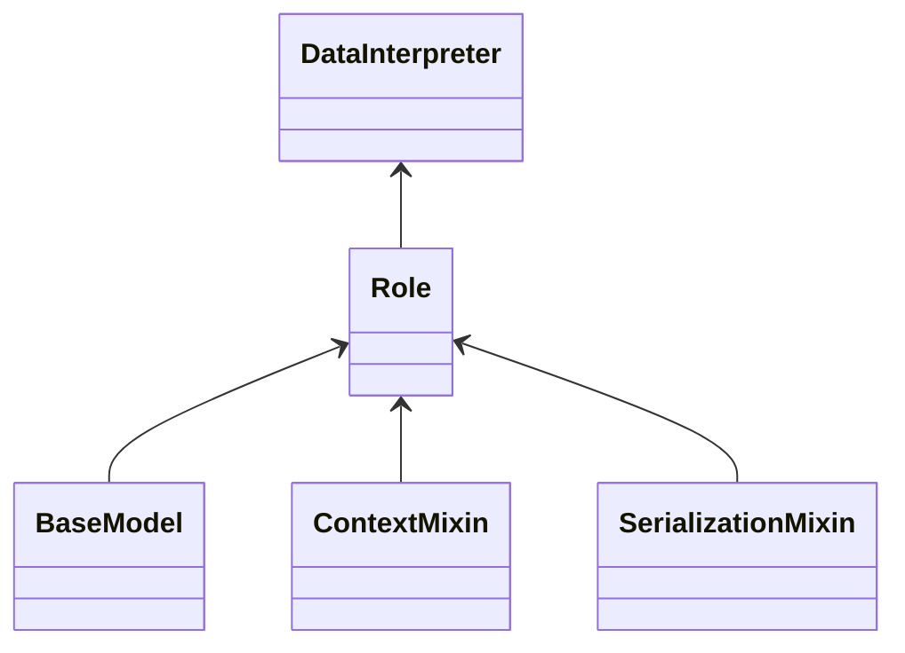

#                                 MetaGPT-DataInterpreter源码解读

> MetaGPT 是一种多智能体框架，其利用SOP（Standard Operating Procedures）来协调多智能体系统。即：**多智能体=智能体+环境+标准流程（SOP）+通信+经济**

**DataInterpreter ：简单三行代码，即可完成用户 `requirement` 任务**

```python
from metagpt.roles.di.data_interpreter import DataInterpreter
mi = DataInterpreter(use_reflection=True, tools=["<all>"])
mi.run(requirement)
```

### `machine_learning`

```python
from metagpt.roles.di.data_interpreter import DataInterpreter
```



#### `DataInterpreter`

```python
mi = DataInterpreter() # 实例化方法
```

```
DataInterpreter(

private_context=None, 
private_config=None, 
private_llm=<metagpt.provider.openai_api.OpenAILLM object at 0x7fa432f2cc40>,

name='David', profile='DataInterpreter', goal='', constraints='', desc='', is_human=False, role_id='', 

states =  ["0. <class 'metagpt.actions.di.write_analysis_code.WriteAnalysisCode'>"],
actions=  [WriteAnalysisCode], 

rc = RoleContext(env=None, msg_buffer=MessageQueue(),
             memory=Memory(storage=[], index=defaultdict(<class 'list'>, {}), ignore_id=False),                       			         working_memory=Memory(storage=[], index=defaultdict(<class 'list'>, {}), ignore_id=False), 
             state=0, todo=WriteAnalysisCode, 
             watch={'metagpt.actions.add_requirement.UserRequirement'},
             news=[], 
             react_mode='plan_and_act',
             max_react_loop=1), 

addresses={'David', 'metagpt.roles.di.data_interpreter.DataInterpreter'},

planner=Planner(plan=Plan(  goal='', context='', tasks=[], task_map={}, current_task_id=''),
                            working_memory=Memory(storage=[], index=defaultdict(<class 'list'>, {}), ignore_id=False),
                auto_run=True),

recovered=False, latest_observed_msg=None, auto_run=True, use_plan=True, use_reflection=False, execute_code=ExecuteNbCode,
tools=[],
tool_recommender=None, react_mode='plan_and_act', max_react_loop=1
)
```

上述展示 `DataInterpreter` 组成，首先补充下 `pydantic` 基础知识点：

**@model_validator(mode="wrap")**：

* 验证器方法需要接受两个参数：`cls`（类本身）和 `value`（要验证的值）
* 可以在自定义逻辑中决定是否调用默认的 `handler` 方法来继续验证过程
* 允许在默认验证之前和之后执行自定义逻辑

**@model_validator(mode="after")：**

* 验证器方法只需要接受一个参数：`value`（已经通过默认验证的值）
* 验证器方法通常以 `self` 作为第一个参数，表示模型实例本身
* 这种模式下的验证器会在 Pydantic 的默认字段验证逻辑之后执行。

**@model_validator(mode="before")**：

* 这种模式下的验证器会在 Pydantic 的默认字段验证逻辑之前执行
* 验证器方法通常以 `cls` 作为第一个参数，表示模型类本身
* 这种模式适用于类方法，因为它们在类级别上操作，可以在创建实例之前对类进行操作

* [x] 要点1：**`SerializationMixin(BaseModel, extra="forbid")`** 

  

```python
      @model_validator(mode="wrap")
      @classmethod
      def __convert_to_real_type__(cls, value: Any, handler):
          # ... 方法实现 ...
  ```

  + `@model_validator(mode="wrap")` 装饰器用于自定义 Pydantic 模型的验证和设置过程。
  + 这个类方法用于在反序列化过程中将字典转换回正确的子类实例。
  + 如果输入值不是一个字典，或者不包含 `__module_class_name` 字段，它会使用默认的处理程序来处理值。
  + 如果 `__module_class_name` 存在，它会查找这个名称对应的类类型，并使用这个类来实例化对象。

  **不是很理解：**这段代码通过自定义序列化和反序列化过程，实现了对多态类的支持。在序列化时，它会将类类型信息添加到输出中；在反序列化时，它使用这些信息来创建正确的子类实例；

* [x] 要点2：**`DataInterpreter(Role)`** 

  

```python
  class DataInterpreter(Role):
      name: str = "David"
      profile: str = "DataInterpreter"
      auto_run: bool = True
      use_plan: bool = True
      use_reflection: bool = False
      execute_code: ExecuteNbCode = Field(default_factory=ExecuteNbCode, exclude=True)
      tools: list[str] = []  # Use special symbol ["<all>"] to indicate use of all registered tools
      tool_recommender: ToolRecommender = None
      react_mode: Literal["plan_and_act", "react"] = "plan_and_act"
      max_react_loop: int = 10  # used for react mode
  
      @model_validator(mode="after")
      def set_plan_and_tool(self) -> "Interpreter":
          self._set_react_mode(react_mode=self.react_mode, max_react_loop=self.max_react_loop, auto_run=self.auto_run)
          self.use_plan = (
              self.react_mode == "plan_and_act"
          )  # create a flag for convenience, overwrite any passed-in value
          if self.tools and not self.tool_recommender:
              self.tool_recommender = BM25ToolRecommender(tools=self.tools)
          self.set_actions([WriteAnalysisCode])
          self._set_state(0)
          return self
  ```

  如果采用 `plan_and_act` 模式，引入规划器 `planner`

  

```
  self.planner = Planner(goal=self.goal, working_memory=self.rc.working_memory, auto_run=auto_run)
  ```

`Planner` : 3 个字段分别是 `plan` 、 `working_memory` 、 `auto_run`

  

```
  class Planner(BaseModel):
      plan: Plan
      working_memory: Memory = Field(
          default_factory=Memory
      )  # memory for working on each task, discarded each time a task is done
      auto_run: bool = False
  
      def __init__(self, goal: str = "", plan: Plan = None, **kwargs):
          plan = plan or Plan(goal=goal)
          super().__init__(plan=plan, **kwargs)
  ```

`plan` 字段也是个类实例，具有的字段如下：

  

```
  class Plan(BaseModel):
      goal: str
      context: str = ""
      tasks: list[Task] = []
      task_map: dict[str, Task] = {}
      current_task_id: str = ""
  ```

  在 `Role` 类 `set_actions` 中有段代码如下：

  

```python
  for action in actions:
              if not isinstance(action, Action):
                  i = action(context=self.context)
              else:
                  '''pass'''
              self._init_action(i)
  ```

`self.context` 是 `ContextMixin` 类中一个方法，返回是 `Context()` 对象实例；

* [x] 要点3：**`Action(SerializationMixin, ContextMixin, BaseModel)`** 

  

```python
  class Action(SerializationMixin, ContextMixin, BaseModel):
      model_config = ConfigDict(arbitrary_types_allowed=True)
  
      name: str = ""
      i_context: Union[
          dict, CodingContext, CodeSummarizeContext, TestingContext, RunCodeContext, CodePlanAndChangeContext, str, None ] = ""
      prefix: str = ""  # aask*时会加上prefix，作为system_message
      desc: str = ""  # for skill manager
      node: ActionNode = Field(default=None, exclude=True)
  ```

  **字段验证：**先执行 `Action` 里字段验证，**mode="before"** 字段从后向前验证；

  

```python
      @model_validator(mode="before")
      @classmethod
      def set_name_if_empty(cls, values):
          if "name" not in values or not values["name"]:
              values["name"] = cls.__name__
          return values
          
      @model_validator(mode="before")
      @classmethod
      def _init_with_instruction(cls, values):
          if "instruction" in values:
              name = values["name"]
              i = values.pop("instruction")
              values["node"] = ActionNode(key=name, expected_type=str, instruction=i, example="", schema="raw")
          return values
  
  ```

  这里验证 `values` 值到底是什么？其实校验就是上述的 `self.context`

  **字段验证：**后执行 `ContextMixin` 里字段验证，**mode="after"** 字段从前向后验证；

  

```python
      @model_validator(mode="after")
      def validate_context_mixin_extra(self):
          self._process_context_mixin_extra()
          return self
  
      def _process_context_mixin_extra(self):
          """Process the extra field"""
          kwargs = self.model_extra or {}
          self.set_context(kwargs.pop("context", None))
          self.set_config(kwargs.pop("config", None))
          self.set_llm(kwargs.pop("llm", None))
          
       def set(self, k, v, override=False):
          """Set attribute"""
          if override or not self.__dict__.get(k):
              self.__dict__[k] = v
  
  ```

  打印下 `self.__dict__`

  

```python
  {'private_context': Context(kwargs=AttrD...': 0.0}})), 'private_config': None, 'private_llm': None, 'name': 'WriteAnalysisCode', 'i_context': '', 'prefix': '', 'desc': '', 'node': None}
  ```

`_init_action` 中 追加 `Action` 字段的 `private_llm` 、 `prefix`

  

### ** `run 方法` :**

```python
mi.run(requirement)
```

* [x] **要点1：`run` 函数使用异步编程并被`role_raise_decorator` 装饰(用于处理在异步函数执行过程中可能出现的异常)；**

  

```python
  @role_raise_decorator
  async def run(self, with_message=None) -> Message | None:
         """Observe, and think and act based on the results of the observation"""
  ```

  

```python
  def role_raise_decorator(func):
      async def wrapper(self, *args, **kwargs):
          try:
              return await func(self, *args, **kwargs)
          except KeyboardInterrupt as kbi:
              logger.error(f"KeyboardInterrupt: {kbi} occurs, start to serialize the project")
              if self.latest_observed_msg:
                  self.rc.memory.delete(self.latest_observed_msg)
              # raise again to make it captured outside
              raise Exception(format_trackback_info(limit=None))
          except Exception as e:
              if self.latest_observed_msg:
                  logger.warning(
                      "There is a exception in role's execution, in order to resume, "
                      "we delete the newest role communication message in the role's memory."
                  )
                  # remove role newest observed msg to make it observed again
                  self.rc.memory.delete(self.latest_observed_msg)
              # raise again to make it captured outside
              if isinstance(e, RetryError):
                  last_error = e.last_attempt._exception
                  name = any_to_str(last_error)
                  if re.match(r"^openai\.", name) or re.match(r"^httpx\.", name):
                      raise last_error
              raise Exception(format_trackback_info(limit=None))
  
      return wrapper
  ```

  这段代码的结构和各个部分的功能如下：

  1. 在`try`块中，调用原始的异步函数`func`，并使用`await`来等待其完成。
  2. 如果在执行`func`时捕获到`KeyboardInterrupt`异常（通常由用户按Ctrl+C触发），代码将记录一个错误日志，并删除角色的最新观察消息`self.latest_observed_msg`，然后重新抛出一个异常。调用的是`traceback.format_exc(limit=limit)`，这是一个用于获取当前异常的堆栈跟踪信息的函数。
  3. 如果异常是`RetryError`，它将检查最后的错误类型，如果错误与`openai`或`httpx`相关，则抛出这个最后的错误。如果异常不是`RetryError`或者最后的错误与`openai`或`httpx`无关，代码将重新抛出一个异常，并包含完整的堆栈跟踪信息。

* [x] **要点2：`Message` 解读：**

  

```python
  class Message(BaseModel):
      """list[<role>: <content>]"""
  
      id: str = Field(default="", validate_default=True)  # According to Section 2.2.3.1.1 of RFC 135
      content: str
      instruct_content: Optional[BaseModel] = Field(default=None, validate_default=True)
      role: str = "user"  # system / user / assistant
      cause_by: str = Field(default="", validate_default=True)
      sent_from: str = Field(default="", validate_default=True)
      send_to: set[str] = Field(default={MESSAGE_ROUTE_TO_ALL}, validate_default=True)
  ```

  ** `Message` 类具有多个字段，包括 `id` 、 `content` 、 `instruct_content` 、 `role` 、 `cause_by` 、 `sent_from` 和 `send_to` ， 使用 Pydantic 的功能来提供类型注解和验证。**

  ** `Field(default=None, validate_default=True)` : 默认值为 `None` ，并且即使它是默认值，也会进行验证。**

  

```python
      def __init__(self, content: str = "", **data: Any):
          data["content"] = data.get("content", content)
          super().__init__(**data)
  ```

  **一旦基类初始化完成，Pydantic 会根据 `@field_validator` 装饰器指定的顺序执行校验函数。**

  

```python
   @field_validator("id", mode="before")
   @classmethod
   def check_id(cls, id: str) -> str:
          return id if id else uuid.uuid4().hex
   @field_validator("instruct_content", mode="before")
   @classmethod
   def check_instruct_content(cls, ic: Any) -> BaseModel:       
       pass
  ```

  **在 `mode="before"` 的情况下，这些校验函数会在字段值被最终赋值给实例属性之前执行，这样可以确保所有的校验逻辑都在属性被设置之前完成。**

  

```python
  user: Run data analysis on sklearn Wine recognition dataset, include a plot, and train a model to predict wine class (20% as validation), and show validation accuracy.
  cause_by:  'metagpt.actions.add_requirement.UserRequirement'
  content:
  'Run data analysis on sklearn Wine recognition dataset, include a plot, and train a model to predict wine class (20% as validation), and show validation accuracy.'
  id:  '39defc4ed634430e9e87893a60557bc3'
  instruct_content: None
  role: 'user'
  send_to: {'<all>'}
  sent_from: ''
  ```

* [x] **要点3：`RoleContext` 解读：**

  

```python
  class RoleContext(BaseModel):
      """Role Runtime Context"""
      model_config = ConfigDict(arbitrary_types_allowed=True)
      # # env exclude=True to avoid `RecursionError: maximum recursion depth exceeded in comparison`
      env: "Environment" = Field(default=None, exclude=True)  # # avoid circular import
      # TODO judge if ser&deser
      msg_buffer: MessageQueue = Field(
          default_factory=MessageQueue, exclude=True
      )  # Message Buffer with Asynchronous Updates
      memory: Memory = Field(default_factory=Memory)
      # long_term_memory: LongTermMemory = Field(default_factory=LongTermMemory)
      working_memory: Memory = Field(default_factory=Memory)
      state: int = Field(default=-1)  # -1 indicates initial or termination state where todo is None
      todo: Action = Field(default=None, exclude=True)
      watch: set[str] = Field(default_factory=set)
      news: list[Type[Message]] = Field(default=[], exclude=True)  # TODO not used
      react_mode: RoleReactMode = (
          RoleReactMode.REACT
      )  # see `Role._set_react_mode` for definitions of the following two attributes
      max_react_loop: int = 1
  ```

  1. `RoleContext` 类是一个用于创建具有多个属性的数据模型，包括环境、消息缓冲区、记忆、状态、待办动作、监听、新消息、回应模式和最大反应循环次数。

  2. `exclude=True` 参数是 `Field` 装饰器的一个选项，用于控制模型序列化时的行为。当一个字段被标记为 `exclude=True` 时，它在默认情况下不会出现在模型的 JSON 序列化结果中。这可以用于隐藏敏感信息或不需要传输的字段。例如：

     

```python
     rc = RoleContext()
     print(rc.json) # 设置 exclude 参数的字段不会被序列化
     ```

  3. `arbitrary_types_allowed=True` 是 `model_config` 中的一个配置选项，它允许模型中使用任意类型的对象作为属性值。设置 `arbitrary_types_allowed=True`，那么 Pydantic 将不会对未知类型的对象进行校验，而是直接允许它们作为模型属性的值。

  4. `msg_buffer`: 这是一个 `MessageQueue` 类型的字段，用于存储消息缓冲区; 

     

```python
     class MessageQueue(BaseModel):
         """
         Message queue which supports asynchronous updates.
         """
         model_config = ConfigDict(arbitrary_types_allowed=True)
         _queue: Queue = PrivateAttr(default_factory=Queue)
     ```

     该类提供多种方法： `push` 、 `pop` 、 `pop_all` 、 `dump` 、 `load` 、 `empty` 方法；

  5. `memory: Memory = Field(default_factory=Memory)` 这是一个 `Memory` 类型的字段，用于存储角色的记忆。

     

```python
     class Memory(BaseModel):
         """
         The most basic memory: super-memory
         """
         storage: list[SerializeAsAny[Message]] = []
         index: DefaultDict[str, list[SerializeAsAny[Message]]] = Field(default_factory=lambda: defaultdict(list))
         ignore_id: bool = False
     ```

     - `storage: list[SerializeAsAny[Message]] = []` 这是一个列表类型的字段，用于存储 `Message` 类型的实例。 `SerializeAsAny` 可能是一个自定义的类型转换器，它允许 `Message` 类型的实例在序列化时被转换为一个可序列化的形式。

     - `index: DefaultDict[str, list[SerializeAsAny[Message]]] = Field(default_factory=lambda: defaultdict(list))` 这是一个 `DefaultDict` 类型的字段，用于存储消息的索引。 `DefaultDict` 是一个特殊的字典，当访问一个不存在的键时，它会自动创建一个默认值。在这个例子中，默认值是一个空列表。这个索引字典的键是字符串类型，值是一个 `SerializeAsAny[Message]` 类型的列表，用于存储与特定键相关联的消息。这个字段使用了 `Field` 装饰器，并且使用了一个 lambda 函数作为默认工厂，这个 lambda 函数返回一个空的 `DefaultDict` 。

     - `ignore_id: bool = False` 这是一个布尔类型的字段，用于表示是否忽略消息的 ID。默认值为 `False` ，意味着消息的 ID 会被考虑在内

       该类提供多种方法： `add` 、 `add_batch` 、 `get_by_role` 、 `get_by_content` 、 `delete_newest` 、 `delete` 、 `clear` 、 `count` 、 `try_remember` 、 `get` 、 `find_news` 、 `get_by_action` 、 `get_by_actions` 方法；

  6.  `default_factory` ：
     使用 `default_factory` 可以确保每次创建模型实例时，可选字段都会被赋予一个新创建的默认实例，而不是共享同一个实例。这对于可变数据类型（如列表、字典）尤其重要；

  7. `news: list[Type[Message]] = Field(default=[], exclude=True)` 这是一个 `Message` 类型的列表字段，用于存储角色的新消息；
     从消息缓冲区 `msg_buffer` 拿到所有未处理的消息 `Message` , 后放置在特定 `Role` 的 `memory` 里， 根据规则过滤感兴趣的消息，放在 `news` 里；（这些消息要么是由 `self.rc.watch` 中的某些内容导致的，要么是发送给 `self.name` 的。此外，这些消息不能在 `old_messages` 中找到，以避免重复处理）

     

* [x] **要点4：`Role` 解读：**

  

```python
  class Role(SerializationMixin, ContextMixin, BaseModel):
      """Role/Agent"""
  
      model_config = ConfigDict(arbitrary_types_allowed=True, extra="allow")
  
      name: str = ""
      profile: str = ""
      goal: str = ""
      constraints: str = ""
      desc: str = ""
      is_human: bool = False
  
      role_id: str = ""
      states: list[str] = []
  
      # scenarios to set action system_prompt:
      #   1. `__init__` while using Role(actions=[...])
      #   2. add action to role while using `role.set_action(action)`
      #   3. set_todo while using `role.set_todo(action)`
      #   4. when role.system_prompt is being updated (e.g. by `role.system_prompt = "..."`)
      # Additional, if llm is not set, we will use role's llm
      actions: list[SerializeAsAny[Action]] = Field(default=[], validate_default=True)
      rc: RoleContext = Field(default_factory=RoleContext)
      addresses: set[str] = set()
      planner: Planner = Field(default_factory=Planner)
  
      # builtin variables
      recovered: bool = False  # to tag if a recovered role
      latest_observed_msg: Optional[Message] = None  # record the latest observed message when interrupted
  
      __hash__ = object.__hash__  # support Role as hashable type in `Environment.members`
  ```

  实例化对字段进行后校验：

  

```python
      @model_validator(mode="after")
      def validate_role_extra(self):
          self._process_role_extra()
          return self
  
      def _process_role_extra(self):
          kwargs = self.model_extra or {}
          if self.is_human:
              self.llm = HumanProvider(None)
          # Check actions and set llm and prefix for each action.
          self._check_actions()      
          # 'You are a DataInterpreter, named David, your goal is . '
          self.llm.system_prompt = self._get_prefix()
          self.llm.cost_manager = self.context.cost_manager
          self._watch(kwargs.pop("watch", [UserRequirement]))
  
          if self.latest_observed_msg:
              self.recovered = True
  ```

  

* [x] **要点5：`react` 方法解读：**

  该方法根据角色当前的回应模式选择执行不同的策略。如果反应模式是 `RoleReactMode.REACT` 或 `RoleReactMode.BY_ORDER` ，则执行 `self._react()` 方法；如果是 `RoleReactMode.PLAN_AND_ACT` ，则执行 `self._plan_and_act()` 方法。

  +  `self._plan_and_act()` ：**直观简洁，很容易理解**

 `DataInterpreter`

```python
        async def _plan_and_act(self) -> Message:
            """first plan, then execute an action sequence, i.e. _think (of a plan) -> _act -> _act -> ... Use llm to come up with the plan dynamically."""
    
            # create initial plan and update it until confirmation
            goal = self.rc.memory.get()[-1].content  # retreive latest user requirement
            await self.planner.update_plan(goal=goal)
    
            # take on tasks until all finished
            while self.planner.current_task:
                task = self.planner.current_task
                logger.info(f"ready to take on task {task}")
    
                # take on current task
                task_result = await self._act_on_task(task)
    
                # process the result, such as reviewing, confirming, plan updating
                await self.planner.process_task_result(task_result)
    
            rsp = self.planner.get_useful_memories()[0]  # return the completed plan as a response
    
            self.rc.memory.add(rsp)  # add to persistent memory
    
            return rsp
    ```

* [x] **要点6：`llm` 大语言模型怎么调用：**

  + `_aask`  方法：

 `DataInterpreter`

```python
        async def _aask(self, prompt: str, system_msgs: Optional[list[str]] = None) -> str:
            """Append default prefix"""
            return await self.llm.aask(prompt, system_msgs)
    ```

    **实例化** `self.llm` :

 `DataInterpreter`

```python
        @property
        def llm(self) -> BaseLLM:
            """Role llm: if not existed, init from role.config"""
            if not self.private_llm:
                self.private_llm = self.context.llm_with_cost_manager_from_llm_config(self.config.llm)
            return self.private_llm
    ```

`llm` **如何回应：**

 `DataInterpreter`

```
      async def _achat_completion_stream(self, messages: list[dict], timeout=USE_CONFIG_TIMEOUT) -> str:
            response: AsyncStream[ChatCompletionChunk] = await self.aclient.chat.completions.create(
                **self._cons_kwargs(messages, timeout=self.get_timeout(timeout)), stream=True
            )
    ```

`self.aclient` 实例化通过 `self.aclient = AsyncOpenAI(**kwargs)` , `kwargs` 是 `{'api_key': 'sk-', 'base_url': 'http://10.9.xx.xx:8000/v1'}`

    输入信息 `self._cons_kwargs(messages, timeout=self.get_timeout(timeout))` 是

 `DataInterpreter`

```python
    'messages':[{'role': 'system', 'content': 'As a data scientist,... function.'}, {'role': 'user', 'content': '\n# User Requirement\n... code\n```\n'}]
    
    'max_tokens':4096
    'temperature':0.0
    'model':'glm4'
    'timeout':600
    ```

    

  

  

  

  

  

  

   
