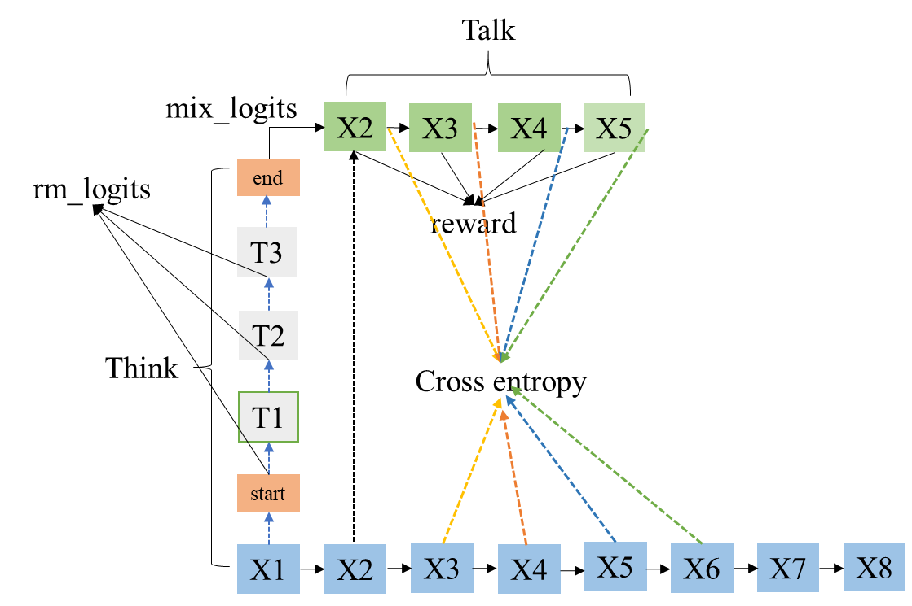

## Quiet-STaR **论文分享**

* #### **摘要：**

  在写作和交谈时，人们有时会停下来思考。尽管以推理为中心的工作通常将推理视为一种回答问题或完成代理任务的方法，但推理实际上几乎隐含在所有书面文本中。例如，这适用于证明的字里行间没有说明的步骤，也适用于对话背后的心理理论。在《e Self-Taught Reasoner》中，有通过推断理由并学习那些导致正确答案的例子，可以实现有用的思考。这是一个高度受限的环境——理想情况下，**语言模型能够从任意文本中学习推断未明确说明的理由**。我们提出了Quiet-STaR，这是STaR的一个扩展，其中语言模型在生成每个词时，学习生成理由以解释未来的文本，从而提高其预测能力。我们解决了几个关键挑战，包括1）**生成续写内容的计算成本**，2）**语言模型最初不知道如何生成或使用内部思考**，以及3）**需要预测超出单个下一个词的内容**。为了解决这些问题，我们提出了一种基于 token 的并行采样算法，使用可学习的  token 指示思考的开始和结束，并采用扩展的教师强制技术。令人鼓舞的是，生成的理由能帮助模型预测难以预测的词，并提高了语言模型直接回答难题的能力。特别是，在使用Quiet-STaR对互联网文本语料库**(open-web-math)**进行持续预训练后，我们发现GSM8K（5.9%→10.9%）和 CommonsenseQA（36.3%→47.2%）上的零样本性能有所提升，并观察到自然文本中困难词的困惑度有所改善。重要的是，这些改进不需要对这些任务进行微调。Quiet-STaR标志着语言模型向更通用和可扩展的推理学习方式迈出了一步。

* #### 背景：

  在语言处理任务中，推理能力对于语言模型的表现至关重要。尽管现有的推理研究通常集中于特定的任务或经过精心设计的数据集，这些方法存在局限性，无法充分利用所有**文本中的隐含推理信息**。为了扩展这一能力，**Quiet-STaR通过让模型在每个Token处生成推理，以预测未来文本**。这一方法无需依赖特定数据集，从通用的网络文本中学习推理模式，从而提升语言模型的表现，特别是在处理复杂问题时。Quiet-STaR不仅减少了模型依赖外部标注数据的需求，还通过优化模型内部思维流程，进一步提高了语言模型在零样本推理任务上的能力。

* #### 知识预备

  假设模型参数 $θ\theta$  在给定观测值( `input_ids` ) 的条件下，自回归生成一段轨迹/句子 `trajectory` ：$τ\tau$
  $$
  \tau = \{{s_1, a_1, r_1, s_2, a_2, r_2, ..., s_T, a_T, r_T}\}
  $$
  **解释下：**

  $sis_i$  表示当前观测状态，对应于自回归模型输入( `input_ids` or `imput_emdings` )；

   $aia_i$ 是动作，等同于模型输入 `input_ids` 经 `forward` 得到的 ` logits` 做 `sample` 操作，在 `vocab` 里选取 `next token` ; 由于 `sample` 具有随机性，相同的观测值未必采取相同的行动； 

  $rir_i$ 是每次操作后所获取奖励分数，具有延时性，即整个推理轨迹完成，才可知道 reward (post_reward) ； 一般是先训练个 `cretic` 对整个推里轨迹进行评分；
  $$
  R(\tau) = \sum_i^{T} r_{n}
  $$
  目标：训练模型参数  $θ\theta$ , 由 $θ\theta$ 采样/生成每条轨迹/句子的奖励分数$R(τ)R(\tau)$ 要高，因此，最大化目标函数：
  $$
  obj_{\theta} = \sum_{\tau} R(\tau)P(\tau|\theta)
  $$
  求解梯度：
  $$
  \nabla  obj_{\theta} = \sum_{\tau} R(\tau) \nabla  P(\tau|\theta) \\
   = \sum_{\tau} R(\tau)P(\tau|\theta) \nabla logP(\tau|\theta) \\
   = \frac{1}{N} \sum^{N}_{1} R(\tau) \nabla logP(\tau|\theta)
  $$
  求$P(τ|θ)P(\tau|\theta)$
  $$
  P(\tau|\theta) = p(s_1)p(a_1|s_1, \theta)p(r_1, s_2|s_1, a_1)p(a_2|s_2, \theta)p(r_2, s_3|s_2, a_2) ...
  $$
  只保留与$θ\theta$ 相关项 
  $$
  logP(\tau|\theta) = \sum_{t=1}^{T} p(a_t|s_t, \theta)
  $$
  最终梯度计算公式如下：
  $$
  \nabla  obj_{\theta} =  \frac{1}{N} \sum^{N}_{n = 1} R(\tau) \nabla logP(\tau|\theta) \\ 

                       = \frac{1}{N} \sum^{N}_{n = 1} \sum^{T}_{t = 1}  R(\tau^{n}) \nabla logp(a_t|s_t,\theta)

  $$
  当$R(τ)R(\tau)$ 都是**正值时**，当 `sample` 数量不足时，已经 `sample` 到  $aia_i$  的概率随参数$θ\theta$ 更新，逐渐调高； 未 `sample` 到  $aja_j$  的概率随参数$θ\theta$ 更新，逐渐变低；但在初始理想的条件下$p(τ|θ)p(\tau |\theta)$ ，$aja_j$ 所产生的奖励可能会比 $aia_i$ 要高；因此需要加入 bais  (beseline) 使得 $R(τ)R(\tau)$ 不完全为正值 ；
  $$
  \nabla  obj_{\theta}  = \frac{1}{N} \sum^{N}_{n = 1} \sum^{T}_{t = 1}  R(\tau^{n} -b ) \nabla logp(a_t|s_t, \theta) \\
  $$

* #### 方法：

  


  我们将训练期间应用的算法可视化为单个思想。我们并行生成想法，遵循文本中的所有标记（**think**）。该模型在其下一个token的预测中混合了思考和不思考的情况**(talk)**。我们应用 **REINFORCE**，以增加帮助模型预测未来文本的想法的可能性，同时丢弃使未来文本不太可能的想法.（**learn**）

* #### 贡献：

  + 从各种非结构化文本数据中学习推理, 而不是在精心策划的推理任务或推理任务集合中进行推理。
  + 提出了一种并行生成的算法, 使我们的训练过程可扩展，从给定字符串中的所有 token 位置生成理由。
  + 我们在每个想法的开始和结束处引入自定义元标记，以便LM了解它应该生成一个理由，以及何时应该基于该理由进行预测。
  + 我们应用一个混合头来回顾性地确定如何将给定思维的下一个标记预测纳入当前的下一个标记预测中(We apply a mixing head to retrospectively determine how much to incorporate the next-token prediction from a given thought into the current next-token prediction)
  + 对于语言建模，包含多个未来词的非短视损失，能够提高思考的效果。
  + 在多个任务上，我们展示了思维使LM能够比在相同网络文本上训练的模型更好地预测困难标记，并且随着思考时间的延长，这种改进更加明显。

* #### **实现细节**

  + **平行生成：**
    Quiet-STaR 的一个关键挑战是有效地在输入序列中的每个标记位置生成理由。这将需要对每个令牌进行单独的前向传递，这对于长序列在计算上变得难以处理。从输入中的每一个 token 采样一个 token, 如果已经为每个标记生成了一个后继标记，那么就不能简单地继续使用原始序列。例如：输入信息 `input_IDS` 维度 (bs, seq_len), 这批数据中每个 token 均会产生 next_token，因此， `generate_ids` 的维度信息也是(bs, seq_len);

    论文举例：前缀输入："< bos >  the  cat  sat"  ， **并行的**为每个 token 生成一个后续的next_token， 得到输出 "yes orange saw down"； 自回归模型，**下一刻推理输入（观测值）** ‘< bos >  the  cat  sat  yes orange saw down ’ ， 显然这是违反句子不连贯事实的；在不改变观测值输入的前提下，怎么为每个单独的token生成合理推理理由（句子序列）呢？ 作者修改 `attention_mask` 矩阵；

    


    

    **预备知识：**整个推理过程有 **prefill (输入编码) 和 decode(当前token预测下一token)** 完成的，在 `decode` 阶段会把先前产生 `K,V` cache 起来，避免重复计算; 此时的输入仅仅为上一时刻 `sample` 到 token 的 `input_ids` ,   而 `K,V` 缓存值通过 `past_key_values` 参数传递。

    **prefill：**

    对上述一批 token 数据 (a, b,c,d ) 分别做编码得到Q，K,  V ，维度( bs,  multi_head_nums,   seq_len,  hidden_dim)  ,  这里 seq_len = 4 ；此时，采用的 `attention_mask` 依然是下三角矩阵，维度信息(bs,  multi_head_nums,   seq_len)，如下(这里省去广播操作)：

    

```python
    >>> attention_mask:
    [[
        [[1,0,0,0],
         [1,1,0,0],
         [1,1,1,0],
         [1,1,1,1]]
    ]]  
    ```

    **decode：**

    由于输入每个token 都需要解码采样(产生理由) , 所以 解码阶段输入是 (a',b',c', d') `input_ids` 和 `past_key_values` ;  相同操作编码得到 Q‘’，K‘’,  V‘’ ，维度( bs,  multi_head_nums,   seq_len,  hidden_dim) ，在做attention之前，K‘’,  V‘’ 分别和 past_key_values 里 K,  V 拼接(dim = -2)；

    Q‘’ ：( bs,  multi_head_nums,   seq_len,  hidden_dim) 

    K‘’ ： ( bs,  multi_head_nums,   seq_len + seq_len  ,  hidden_dim) 

     V‘’  ：( bs,  multi_head_nums,   seq_len + seq_len ,  hidden_dim) 

    为了让每个推理路线上的 token 彼此不可见，需要拼接对角阵；

    

```
    >>> attention_mask:
    [[
        [[1,0,0,0,1,0,0,0]
         [1,1,0,0,0,1,0,0],
         [1,1,1,0,0,0,1,0],
         [1,1,1,1,0,0,0,1]]
    ]] 
    ```

    将 attention_mask 行方向视为 `a,b,c,d,a',b',c',d'` ，纵方向视为 `	a',b',c',d'` , 例如在对 `b'` 做 `attention` 操作是否只能看到 `a,b,b'` ;

    **代码实现：**

    

```python
    original_attention = original_attention == attention_mask.max()
    # because eye isn't implemented for BF16, we need to handle the case
    if not attention_mask.dtype == torch.bfloat16:
        new_attention = torch.eye(
        seq_len, dtype=attention_mask.dtype, device=attention_mask.device
        )
    else:
        new_attention = torch.eye(
        seq_len, dtype=torch.float32, device=attention_mask.device
        ).to(attention_mask.dtype)
    new_attention = new_attention.view(1, 1, seq_len, seq_len).repeat(input_ids.shape[0], 1, 1, 1)
    new_attention = new_attention * original_attention
    new_attention[new_attention == 0] = attention_mask.min()
    new_attention[new_attention == 1] = attention_mask.max()
    attention_mask = torch.cat([attention_mask, new_attention], dim=-1)
    ```

  + **元标记：**
    在每个 `token` 推理理由(推理轨迹) 首位插入"<|startthought|>"，  "<|endthought|>"   这两个 `marker` ,  且可训练；初始化时用 `---` 的 embedding 进行初始化；因为 `---` 经常出现在文本数据中，以表示暂停或想法；直观地说，开始思维标记可以理解为将模型放入“思维模式”中，结束思维标记可以理解为在完成思维时告诉模型。

  + **混合头：**
    一个三层的MLP作为混合头：

    

```
    Sequential(
      (0): Linear(in_features=8192, out_features=4096, bias=True)
      (1): ReLU()
      (2): Linear(in_features=4096, out_features=4096, bias=True)
      (3): ReLU()
      (4): Linear(in_features=4096, out_features=1, bias=False)
    )
    ```

    在不考虑思考的条件下，原始 hidden：
    $$
    base\_hidden\_states =  hidden\ states_{θ_i}(a,b,c,d)
    $$
    在思考的条件下，talk_hidden：
    $$
    talk\_hidden\_states =  hidden\ states_{θ_i}(\\a,b,c,d,\\<|startthought|>,<|startthought|>,<|startthought|>,<|startthought|>,\\ a',b',c',d', \\ a'',b'',c'',d'',\\.,.,.,., \\ <|endthought|>,    <|endthought|> ,   <|endthought|> ,  <|endthought|> ,\\  
    )
    $$
    将两者拼接，在作用于三层的MLP，输出一个权重。这一权重用于决定前者以多大的比例与后者进行混合，从而逐步引导模型学习如何有效利用推理，提升对下一个Token的预测准确性。

    

```
     head_input_hidden_states = torch.cat([base_hidden_states, talk_hidden_states], dim=-1)
     residual_logits = self.talk_head[0](head_input_hidden_states)
     residual_logits = cur_base_hidden * (1 - residual_logits) + talk_hidden_states * residual_logits
     residual_logits = apply_head(self.lm_head, residual_logits)
    ```

    其实本质上就是改变采样分布。

  + **非短视评分和教师强制**：
    因为我们不期望思想在预测每个标记时都有用，所以我们更希望模型的奖励**较少依赖于紧跟**在思想之后的文本中的确切下一个词，而更多依赖于接下来的语义内容。在平行采样策略下，与传统的基于transformer的语言建模不同，只有对应于下一个token预测的thoughts会收到该预测的梯度。为了解决这个问题，我们可以通过在采样前添加损失项来为未来的tokens计算梯度。然而，这将导致语言模型的整体熵显著增加，并且生成的文本质量较低，因为这会使语言模型部分忽略其前面的令牌。相反，我们使用并行注意掩码来计算真实下一个token的概率，并通过假设模型选择了正确的下一个ground-truth token来应用教师强迫。

    **上述论文的写的不太好理解，看不懂的话，请看我的理解，下图**

    



    上图中 `mix_logits` 是经过上述 `混合头` 处理过得到的采样分布 `residual_logits` (如上)，包含采用思考和未思考的信息；  

`mix_logits` =    $α∗p(Xi|X1, ..., Xi−1, start, ...end; θ) \alpha * p(X_{i}|X_1, ..., X_{i-1}, start, ...end; \theta)$  +   $(1−α)∗p(Xi|X1, ..., Xi−1; θ)(1-\alpha) * p(X_{i}|X_1, ..., X_{i-1}; \theta)$

    上图中 `rm_logits` 是在仅仅思考的条件下 ：  $p(Ti|X1,start,...;θ)p(T_{i}|X1,start,...;\theta)$ 计算的得到采样分布；

    设置两个超参数   $n_aheadn\_ahead$,  $n_ahead_talkn\_ahead\_talk$  

    $n_aheadn\_ahead $ ： 是内部思考阶段做 `forward` 次数，上图($n_ahead=6n\_ahead = 6$ ) 表示 **X1 --> start,  start- -> T1 , ...  T3-->end,  end-->X2**  ; 共有 6 次 `forward` 操作。

     $n_ahead_talkn\_ahead\_talk$  ：number of ground truth tokens used for **supervising each thought** , 上图($n_ahead_talk=4n\_ahead\_talk = 4$ ),  用于获取奖励分数；

     在给定观测值$ss$ 状态前提下，模型$θ\theta$ sample 轨迹 $τ\tau$ ,  例如：

    

```python
    state : X1
    trajectory ACTION :  start,T1,T2,T3,end,X2,X3,X4,X5 
    
    state : X1X2
    trajectory ACTION:   start,t1,t2,t3,end,X3,X4,X5,X6 
    
    state : X1X2X3
    trajectory ACTION:   start,tt1,tt2,tt3,end,X4,X5,X6,X7
    ```

    假设语料库一批数据 `Data:` 大小 ` ( bs,  seq_len)` ,    在模型参数 $θ\theta$ 的前提下， sample 轨迹 $τ\tau$ 的数量总和为 $bs∗seq_lenbs* seq\_len$  ,   回忆下强化学习的目标损失函数，在所有$τ\tau$ 上奖励分数总和最大化；

    由于轨迹 $τ\tau$  是由 `think` 和 `talk ` 两个阶段组成， `think` 阶段是无标注的， `talk` 是有标记的，怎么定义$τ\tau$ 的奖励分数$R(τ)R(\tau)$ 呢？ 当然是引入 `CrossEntropyLoss`

    - **什么是非短视评分？**
      比如说一条轨迹$τ\tau$ 是 ` {X1, start,T1,T2,T3,end,X2,X3,X4,X5 }` , 在给定X1和思考链式的前提下，不要仅仅单单预测 X2， 而是考虑更多的 接下来的语义内容 `(X2,X3,X4,X5)` ；即：奖励分数$R(τ)R(\tau)$ 表示如下：
      $$
      \R(\tau) = \\
      reward(X2|X1, start,T1,T2,T3,end;\theta)\\ + reward(X3|X1,start,T1,T2,T3,end,X2;\theta)\\+ reward(X4|X1, start,T1,T2,T3,end,\theta) \\+ reward(X5|X1, start,T1,T2,T3,end,X2,X3,X4;\theta)
      $$

      $n_ahead_talk=4n\_ahead\_talk = 4$，在一条轨迹 $τ\tau$  ， `Talk ` 阶段，每个 ` ground truth tokens` 均用于监督 `Think` ; 用交叉熵 `CrossEntropyLoss` 表示 `reward` 可以吗, 再次回忆下强化学习公式，$R(τn−b)R(\tau^{n}-b)$ : $τ\tau$ 轨迹上不仅要好，还要好于 `baseline` （不引入 `think` 条件的交叉熵）; 
      $$
      \nabla  obj_{\theta}  = \frac{1}{N} \sum^{N}_{n = 1} \sum^{T}_{t = 1}  R(\tau^{n} -b ) \nabla logp(a_t|s_t, \theta) \\
      $$

    

      $$
      \R(\tau) = \\
      Loss(X2|X1, start, T1, T2, T3, end; \theta) - Loss(X2|X1; \theta)\\ 

      + Loss(X3|X1, start, T1, T2, T3, end, X2; \theta)- Loss(X3|X1, X2; \theta)\\+ 
      Loss(X4|X1, start, T1, T2, T3, end, \theta)- Loss(X4|X1, X2, X3; ; \theta) \\+ 
      Loss(X5|X1, start, T1, T2, T3, end, X2, X3, X4; \theta) - Loss(X5|X1, X2, X3, X4; \theta)
      $$

    

    **这个奖励分数可以理解为 熵减少的程度，加入在不思考直接回答，熵值是0.4；经过思考后回答，熵值是0.2；可以直观感受 思考带来的奖励分数是0.2，通过思考，熵向较少的方向进行。(困惑度也随之降低)**

    

    现在计算 一批数据 `Data` : 大小 `( bs,  seq_len)` , 在 $n_ahead_talkn\_ahead\_talk$  下， 会产生多少轨迹$τ\tau$ 呢?

    

    答案是  $bs∗(seq_len−1−n_ahead_talk)bs * (seq\_len -1 - n\_ahead\_talk)$ 

    

    即：批量序列里最后一个 `token` 无 `label` , 且需要保证每条轨迹 $τ\tau$  要有 $n_ahead_talkn\_ahead\_talk$  用于监督 `think` 的 `token label` ， 看图体会。

    

    - **每个token 想生成 多个 think ，该怎么办？**

    

    上文主要介绍 每个 `token ` 生成一条推理轨迹，如果想生成n条推理过程怎么处理呢？作者这里将批量样本输入做n次 `Double` 处理, 即数据大小变为 `(n*bs,seq_len)` ，相同输入在 `think` 阶段采样具有不同(随机性)，这就形成不同的推理理由。

    

    当产生多个推理轨迹时，做去中心化，即：优化那些轨迹，其轨迹奖励分  **要高于** 所有轨迹奖励平均分 ； 

    

    

```
    if self.trice_mode and self.n_passes > 1:
        batched_policy_reward = train_policy_reward.reshape(-1, self.n_passes, train_policy_reward.shape[-1])
        # average over the passes
        train_policy_reward = batched_policy_reward - batched_policy_reward.mean(dim=1, keepdim=True)
        train_policy_reward = train_policy_reward.reshape(-1, train_policy_reward.shape[-1])
    ```

    

    - **教师强制**

    

      很好理解，就是不根据 `mix_logits` 的分布做概率采样，而是做强制采样操作，强制采样下一个真实的 `groud_true`  `token` ; 

    

      例如：一条轨迹$τ\tau$ 是 `{X1, start,T1,T2,T3,end,X2,X3,X4,X5 }` ， 强制采样的token为 `{start,end,X2,X3,X4,X5},` ; 

    

      根据概率分布 `rm_logits` 随机采样的是： `｛T1,T2,T3｝` 。

​      

* #### **损失函数**

  $$
  \nabla  obj_{\theta}  = \frac{1}{N} \sum^{N}_{n = 1} \sum^{T}_{t = 1}  R(\tau^{n} -b ) \nabla logp(a_t|s_t, \theta) \\
  $$

  通过上述的方法已经计算每一条有效的轨迹$τ\tau$ 的奖励分数$R(τ)R(\tau)$ , $[bs, seq_len−1−n_ahead_talk][bs, seq\_len -1 - n\_ahead\_talk ]$ , 需要求解是$p(at|st, θ)p(a_t|s_t, \theta) $; 

  以上述例子说明，这里$at∈[T1, T2, T3]a_t \in [T_1, T_2, T_3]$ , $st∈[(X1, START), (X1, START, T1), (X1, START, T1, T2)]s_t \in [(X1, START), (X1, START, T1), (X1, START, T1, T2)]$. 在 `forward` 中需要记录下 `action_loglikelihoods`

  

```python
   if not did_skip_sampling:   #非强制采样 
       nonzero_indices = prev_probabilities_2d.nonzero()  # one-hot
       action_loglikelihoods = F.log_softmax(prev_sample_probs / self.reinforce_temperature, dim=-1)[nonzero_indices[:, 0], nonzero_indices[:, 1]]       #求解logp(a_t|s_t,\theta)
       action_loglikelihoods_2d = action_loglikelihoods.reshape(batch_size, -1)
  ```

  在$T2T2$ 采样之前需要将上次采样$T1T1$ 的 `loglikelihoods` 记录下来，依次类推；

  1. REINFORCE损失: 优化生成内部推理的对数似然，提高模型对未来tokens的预测准确性。
     1. 定义奖励 $$rjr_j$$为当前内部推理相对于平均内部推理的差异，计算方式如下：

        $$rj=log⁡pj:j+ntruetalk(Xj+1:j+ntrue+1)−log⁡p¯j:j+ntruetalk(Xj+1:j+ntrue+1)  r_j = \log p^{talk}_{j:j+n_{\text{true}}}(X_{j+1:j+n_{\text{true}}+1}) - \log \bar{p}^{talk}_{j:j+n_{\text{true}}}(X_{j+1:j+n_{\text{true}}+1})$$ $$∇LREINFORCE=−r⋅∇log⁡pθ(T|[X;<start of thought>])\nabla L^{REINFORCE} = -r \cdot \nabla \log p_\theta(T | [X; <\text{start of thought}>])$$

     2. 通过该奖励更新语言模型的参数，鼓励生成比平均更好的合理性。

  2. 对数似然损失 $$LNLLL^{NLL}$$: 这是 LLM 的基础损失，确保模型在生成文本时能够优化其输出。
     $$LjNLL←−log⁡pj:j+ntruetalk(Xj+1:j+ntrue+1)L^{NLL}_j \leftarrow -\log p^{talk}_{j:j+n_{true}}(X_{j+1:j+n_{true}+1})$$

  3. 总损失：在更新策略的过程中，会将两者结合来优化模型。
     1.  $$∇θLj←∇θLjNLL+∇θLjREINFORCE\nabla_{\theta} L_j \leftarrow  \nabla_\theta L^{NLL}_j + \nabla_\theta L^{REINFORCE}_j$$

* #### 代码解读

  

```python
  ## forward 入参
  input_ids: torch.LongTensor = None,
  attention_mask: Optional[torch.Tensor] = None,
  position_ids: Optional[torch.LongTensor] = None,
  past_key_values: Optional[List[torch.FloatTensor]] = None,
  inputs_embeds: Optional[torch.FloatTensor] = None,
  labels: Optional[torch.LongTensor] = None,
  use_cache: Optional[bool] = None,
  output_attentions: Optional[bool] = None,
  output_hidden_states: Optional[bool] = None,
  return_dict: Optional[bool] = None,
  ```

  1. 如果每个`token`存在多条推理理由时，先复制样本(n份)，每份都有唯一的推理轨迹；

  

```python
  def none_repeat_interleave(x, n):
      if x is None:
          return x
      return x.repeat_interleave(n, dim=0)
  
  if self.n_passes > 1:  # 每个单独的 token 要产生多少推理理由，就copy多少份  
      input_ids = none_repeat_interleave(input_ids, self.n_passes)
      attention_mask = none_repeat_interleave(attention_mask, self.n_passes)
      position_ids = none_repeat_interleave(position_ids, self.n_passes)
      inputs_embeds = none_repeat_interleave(inputs_embeds, self.n_passes)
      labels = none_repeat_interleave(labels, self.n_passes)
      if past_key_values is not None:
          past_key_values = [none_repeat_interleave(p, self.n_passes) for p in past_key_values]
  ```

  2. 用`---` token的 Embedding  来初始化  `"<|startthought|>"、 "<|endthought|>" ` , 以 `"<|startthought|>"` 为例：

  

```python
  ## init 先定义是可选参数,第0行存scale的参数值, 第1行存参数方差信息(采用'---'作为初始化,不起作用)
  self.start_embedding = nn.Parameter(torch.zeros(2, self.model.config.hidden_size))
  ## forward:  <|startthought|> in add_token  
  self.start_token_id = self.tokenizer.convert_tokens_to_ids("<|startthought|>")
  base_start_id = self.tokenizer.encode('---', add_special_tokens=False)[0]   
  # 参数赋值操作 self.model.embed_tokens.weight.data 是embedding矩阵【vocab,self.model.config.hidden_size 】 
  self.start_embedding.data[0] = self.model.embed_tokens.weight.data[base_start_id].clone().detach() / self.embedding_scale
  self.start_embedding.data[1] = torch.log(self.model.embed_tokens.weight.data.std(dim=0) * self.thought_init_std_scale / self.embedding_scale)
  
   start_embedding = self.start_embedding[0].unsqueeze(0) * self.embedding_scale
  ```

  3. 生成轨迹$τ\tau$ , 包含`think`,  `talk` 两个阶段，`forward` 迭代次数:   $n_ahead+n_ahead_talk−1n\_ahead + n\_ahead\_talk -1$
     

```python
     for ahead_idx in range(fwd_iters):
     ```

     + `ahead_idx == 0` :

       1. `forward` 计算并全局保存原始(没有think)的 `base_hidden_states` 和 `initial_loss_logits`

       2. 强制采样 `"<|startthought|>"`

          

```python
          override_token = self.start_token_id
          probabilities_2d = torch.zeros_like(probabilities_2d)
          probabilities_2d[:, override_token] = 1.0
          skip_sampling = True
          ```

       3. 更新模型输入 `inputs_embeds` 和 `new_attention` 和 `position_ids` 和 `past_key_values`

          

```python
          cur_thought_embedding = start_embedding 
          inputs_embeds = cur_thought_embedding.unsqueeze(0).repeat(batch_size, seq_len, 1)
          inputs_embeds =inputs_embeds.view(probabilities.size(0),probabilities.size(1),-1)
          ```

          需要注意下：输入和输出的token数量相同是否能够适配 `RoPE` 呢？例如:输入： `a,b,c,d` 输出: ` a',b',c',d'`

          

```
           position_ids = position_ids + 1
          ```

`a,b,c,d` :[0, 1, 2, 3] ` a',b',c',d'` :[1, 2, 3, 4]

           当然适配，例如 `c'` 前面的 `token` 只能是 `a,b,c` , 故 `c'` 的 `position_ids = 3 ` 非常合理；

     + `ahead_idx in [1,n_ahead - 2)` :

`forward` 并根据 `rm_logits` (**只思考，没使用混合头**)  进行采样， 并更新输入；

       

```python
       probabilities = rm_logits
       probabilities_2d = probabilities.view(-1, probabilities.size(-1))
       sample_probs = probabilities_2d  
       probabilities_2d = F.gumbel_softmax(sample_probs, tau=temperature, hard=True, dim=-1) # hard=True 输出one_hot
       # 更新输入 
       inputs_embeds = probabilities_2d @ (self.model.embed_tokens.weight.to(probabilities.device)
       ```

     + `ahead_idx == n_ahead - 2`

       强制采样 `"<|endthought|>"` ,类似强制采样 `<|startthought|>` ,  整个 `think` 阶段结束，并记录该阶段采样动作所对应的 `action_loglikelihoods` ；整个思考过程是无监督的，采样不同的**action**- `｛T1,T2,T3}` 是不知道，但是可以知道：采样这些**action** 能带来多少奖励； 最大化奖励，就可以优化这些可能的采样方向；

     + `ahead_idx >= n_ahead - 1`

       ** `talk:1` 阶段:  强制采样 `ground_true` ** 

       

```
        cur_talk_n = ahead_idx - (self.n_ahead - 1) + 1
        shift_labels = labels[..., cur_talk_n:].contiguous().to(probabilities_2d.device)
        padding = torch.full_like(
                                labels[..., :cur_talk_n],
                                self.tokenizer.pad_token_id,
                                dtype=torch.long,
                                device=shift_labels.device
                                )
        new_rm_tokens = torch.cat(
                        [shift_labels, padding],
                        dim=-1
                         )
        # convert rm tokens to one-hot
        probabilities_2d = F.one_hot(new_rm_tokens,num_classes=self.vocab_size).reshape(-1,self.vocab_size)
        skip_sampling = True
       ```

       假设一批数据【x1,x2,x3】, 初始状态 `state：x1 ` 会产生一条推理轨迹 $τ\tau$ , 轨迹 $τ\tau$  在 `n_ahead - 1` 时刻，也就是 `<|endthought|>` 时刻, 产生 `mix_logits` ，采用教师强制技术，不能从 `mix_logits` 采样，需要从【x1,x2,x3】中采样 X1 的后一个 `token` ,  这就是 `shift_labels` .

       同理：并行的，初始状态 `state：x1x2 ` 会产生一条推理轨迹 $τ\tau$ ， 需要从【x1,x2,x3】中采样x1,x2 的后一个 `token` .

       ** `talk:1` 阶段:  使用混合头计算 `mix_logits` ，计算交叉熵和奖励分数**

       

```
       original_dqn_reward = cur_policy_reward_base_loss.detach() - unreduced_loss
       ```

       很简单，使用思考**(带混合头)**的交叉熵 - 原始**(不思考)**交叉熵；

       **混合头计算需要注意一点：**

       **输入样本：** 【**X1,X2,X3,X4,X5,X6,X7,X8**】，在观测值**X1** 的条件下，Sample出一条轨迹$τ\tau$ 是由 ` {X1, start,T1,T2,T3,end,X2,X3,X4,X5 }` ，当前轨迹$τ\tau$ 是由输入样本的第**0**个索引产生，在该轨迹上**X2** 时刻，需要做**混合头** 计算 `mix_logits` 。 

       

```
       head_input_hidden_states = torch.cat([cur_base_hidden, talk_hidden_states], dim=-1)
       # 带有思考hidden 和未带思考 hidden 先拼接，后作用于混合头MLP	
       residual_logits = self.talk_head[0](head_input_hidden_states)
       ```

       1.在引入**思考前提下计算**得到 `cur_hidden_states` 矩阵，当前轨迹所对应结果保留在第0个索引上，即 `cur_hidden_states[:,0,:]` ,

       2.在原始 `base_hidden_states` 矩阵，关于元素**X2**产生的结果，是保存在 `base_hidden_states` 第1个索引上，即 `base_hidden_states[:,1,:]`

       为能够实现【**X1,X2,X3,X4,X5,X6,X7,X8**】并行计算，需要将 `base_hidden_states` 根据偏移量进行移位， `base_hidden_states` 按 `seq_len` 维度上平移；

       3.上述平移会将原本 `base_hidden_states[:,0,:]` 平移到 `base_hidden_states[:,-1,:]` ， 那岂不是会对 $X8X8$ 产生轨迹$τ\tau$ 有影响吗？答案是是的，不过没关系；因为$X8X8$ 产生轨迹$τ\tau$ 不是有效轨迹，不参与损失和奖励计算。

       

```python
       if ahead_idx > self.n_ahead - 1:
                   shift_idx = 1 + max(0, ahead_idx - (self.n_ahead - 1))
                   cur_base_hidden = torch.cat([
                           base_hidden_states[..., shift_idx:, :],
                           base_hidden_states[..., :shift_idx, :]
                           ], dim=-2)
       ```

       计算 `Cross_entropy` 一样

       

```
                           shift_logits = loss_logits[..., :-shift_idx, :].contiguous()
                           shift_labels = labels[..., shift_idx:].contiguous()
       ```

  

   

  ​    

  
