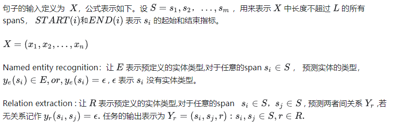
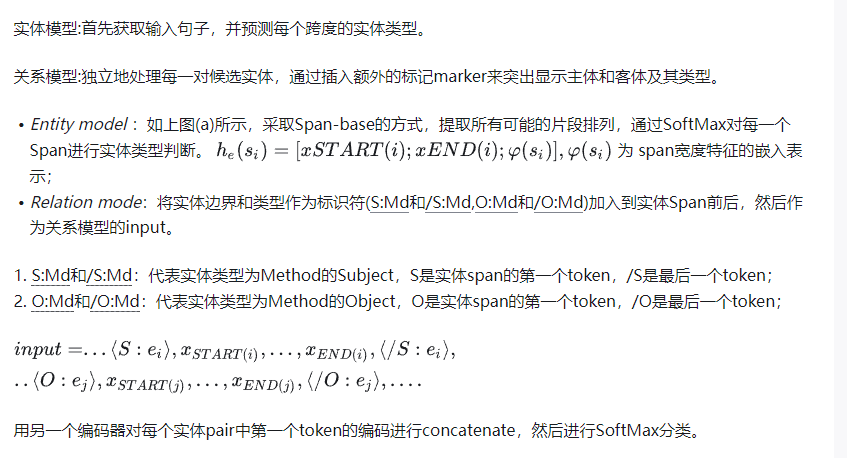
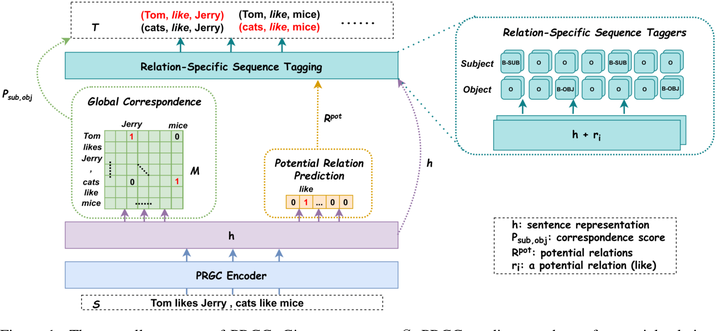
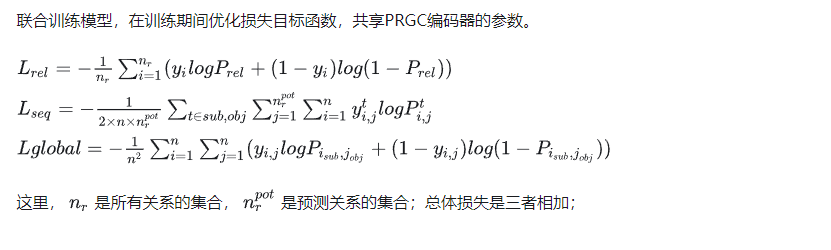
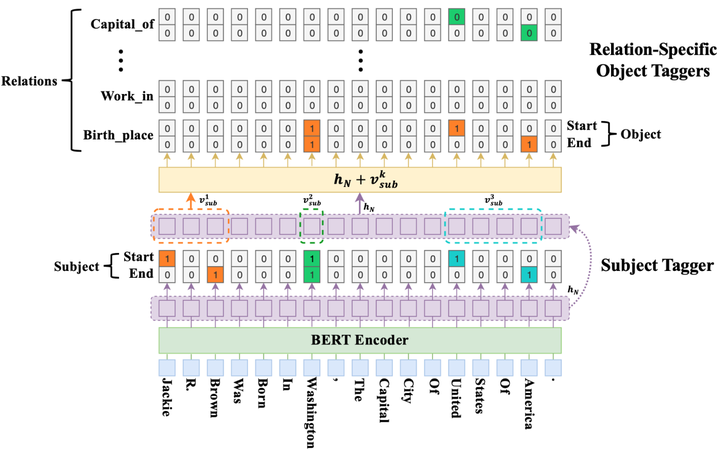
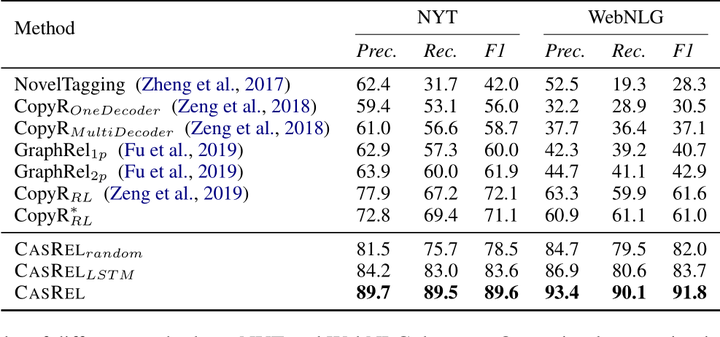
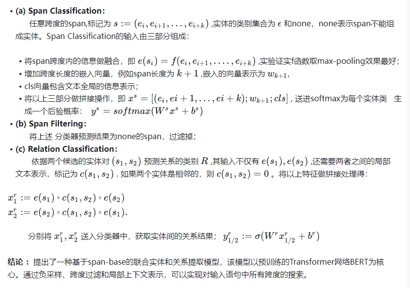

### **《A Frustratingly Easy Approach for Entity and Relation Extraction》阅读记录**

- 来源：arXiv 2021
- 论文地址：https://arxiv.org/pdf/2010.12812.pdf
- 开源代码：[https://github.com/princeton-nlp/PURE](https://hub.fastgit.xyz/princeton-nlp/PURE)

###  **Abstract：** 

端到端关系抽取目的是为了识别命名实体并提取实体间的关系。本文提出pipelined方法，构建在两个独立的编码器上，只使用实体模型来构造关系模型的输入。说明以下几点重要性：

- 实体识别任务和关系抽取任务需要不同的上下文表示形式；
- 关系模型中融合实体信息很重要；
- 整合全局上下文信息很重要

### **创新点：**

-  设计了end2end关系抽取方法，即采取2个独立的编码器分别用于实体抽取和关系识别，使用相同的预训练模型超越之前所有的joint模型；
-  分别学习实体和关系的不同上下文表示，比联合学习它们更有效
-  在关系模型的输入层融合实体类别信息十分重要

**模型架构：**


*Figure 1: An example from the SciERC dataset (Luan et al., 2018). Given an input sentence MORPA is a fully implemented parser for a text-to-speech system, an end-to-end relation extraction system is expected to extract that MORPA and PARSER are entities of type METHOD, TEXT-TO-SPEECH is a TASK, as well as MORPA is ahyponym of PARSER and MORPA is used for TEXT-TO-SPEECH. (a) Our entity model predicts all the entities at once. (b) Our relation model considers every pair of entities independently by inserting typed entity markers (e.g., [S:MD]: the subject is a METHOD, [O:TK]: the object is a TASK). (c) We also proposed an approximation relation model which supports batch computations. The tokens of the same color share the positional embeddings*

### **Problem Definition**



### **Approach**




### **Efficient Batch Computations**

如上图c所示, 在attention层中，文本token只去attend文本token、不去attend标识符token，而标识符token可以attend原文token。相同的颜色代表共享相同的位置向量,即实体标识符和实体共享相同的位置编码；

###  **结论 ：**

​      提出了一种简单有效的端到端关系提取方法。采用两个编码器，分别用于实体识别和关系提取，在三个标准基准上显著优于以前的水平。


------


### **《PRGC: Potential Relation and Global Correspondence Based Joint Relational Triple Extraction》阅读记录**

- 来源：ACL 2021
- 论文地址：https://arxiv.org/pdf/2106.09895
- 开源代码：[https://github.com/hy-struggle/PRGC](https://hub.fastgit.xyz/hy-struggle/PRGC)

### Abstract： 

​       从非结构化文本中联合抽取实体和关系是信息抽取的一个关键问题。一些方法取得了良好的性能，但仍存在一些固有的局限性，如关系预测的冗余性、基于区间的提取泛化能力差和效率低下。文章从一个新的角度将任务分解为关系判断、实体提取和主客体对齐三个子任务，并提出了一个基于潜在关系和全局对应的联合三胞组提取框架。

- **three subtasks**
- Relation Judgement：设计了一个预测潜在关系的组件，将实体的提取限制在预测的关系子集，而不是所有的关系；
- Entity Extraction：应用特定于关系的序列标注组件处理主体与客体之间的重叠问题；
- Subject-object Alignment：全局对应组件是将主体与客体对齐，以低复杂度的方式组合成一个三元组；

### **文章工作**

​        关系抽取可以分为流水线和联合提取的方法，文章采用端到端联合提取三元组，主要解决问题如下：

​       \- span-based方法：仅仅关注于实体的首尾，泛化性能差；

​        \- Casrel方法：首先提取主体，每种关系分别看做映射函数，匹配相对应的客体，很容易造成关系冗余，效率低下；

本文将关系提取任务分为三个组件：Potential Relation Prediction从所有冗余关系中，预测出候选关系；Entity Extraction主要采用 Relation-Specific Sequence Tagging 的方法解决主体客体的 overlap问题；Global Correspondence matrix 确定 specific实体关系对是否有效；

### **模型架构：**




*Figure 1: The overall structure of PRGC. Given a sentence S, PRGC predicts a subset of potential relations Rpot and a global correspondence M which indicates the alignment between subjects and objects. Then for each potential relation, a relation-specific sentence representation is constructed for sequence tagging. Finally we enumerate all possible subject-object pairs and get four candidate triples for this particular example, but only two triples are left (marked red) after applying the constraint of global correspondence.*

### **PRGC编码器**


###  **PRGC 解码器**

- 

### **损失函数**



### **对比实验**


### **结论：**

​	    	提出了一种全新的视角，提出了一种基于预测关系和全局对应的联合关系抽取框架，极大地缓解了关系判断冗余、span_base抽取泛化能力差和主客体对齐效率低的问题。实验结果表明，我们的模型在公共数据集上达到SOTA，能处理许多复杂的场景。


------


### Casrel: **A Novel Cascade Binary Tagging Framework for Relational Triple Extraction**

- 论文地址：https://arxiv.org/abs/1909.03227 
- 开源代码：https://github.com/powerycy/Lic2020-

### **Abstract：** 

​       本文提出一种新颖的级联二值标记框架（ cascade binary tagging framework），来解决三元组 overlap的问题；这个模型框架把关系抽取看成一个从主体映射到客体的函数，而不是把关系看成离散的 标签；在不同的overlap场景中取得了SOTA的效果；

**解决问题：** 

​        把关系类别看成离散标签存在的问题：

```
        - 关系类别标签的分布是不均匀的，大多数实体对之间没有关系，将产生大量的负样本；
        - 在关系overlap的场景下，相同的实体具有多个关系，导致分类器很困惑；
```

本文把关系看成从主体映射到客体的函数；分两阶段进行（a subject tagging module 和 a relation-specific object tagging module），首先识别句子中所有的主体，之后用specific taggers识别所有的关系和客体；

**模型架构：**




Figure:*An overview of the proposed CASREL framework. In this example, there are three candidate subjects detected at the low level, while the presented 0/1 tags at high level are specific to the first subject Jackie R. Brown, i.e., a snapshot of the iteration state when k = 1 is shown as above. For the subsequent iterations (k = 2, 3), the results at high level will change, reflecting different triples detected. For instance, when k = 2, the high-level orange (green) blocks will change to 0 (1), respectively, reflecting the relational triple (Washington, Capital of, United States Of America) led by the second candidate subject Washington.*

###  **The CASREL Framework** 


### BERT编码器 


### Cascade Decoder 


实验结果分析 



### 结论

​       本文不是将关系建模为实体对的离散标签，而是将关系建模为将主体映射到对象的函数，这为重新审视关系三元组提取任务提供了一个新的视角。因此，我们的模型可以同时从句子中提取多个关系三元组，而不存在重叠问题。

------


### **Span-based Joint Entity and Relation Extraction with Transformer Pre-training**

### **Abstract：** 

​       本文引入 一种span-based的实体和关系提取的注意力模型（SpERT）。主要贡献是对BERT嵌入做轻量级推理，进行实体识别和实体过滤。同时使用本地化的、无标记的上下文的表示，进行关系分类。在一次BERT通道中有效地提取负样本，使用句内负采样辅助训练。

### **模型架构：** 


*Our approach towards joint entity and relation extraction SpERT first passes a token sequence through BERT. Then, (a) all spans within the sentence are classified into entity types, as illustrated for three sample spans s1, s2, s3 (red). (b) Spans classified as non-entites (here, s1) are filtered. (c) All pairs of remaining entities (here, (s2, s3)) are combined with their context (the span between the entities, yellow) and classified into relations.*

### Approach



------


> **END-TO-END NAMED ENTITY RECOGNITION AND RE-LATION EXTRACTION USING PRE-TRAINED LANGUAGE MODELS**

### **Abstract：** 

​       提出了一个神经端到端模型，用于联合提取实体及其关系，该模型不依赖于外部的NLP工具，并集成了一个大型的、预先训练的语言模型。

### **模型架构：** 


​                                                   *Figure : Joint named entity recognition (NER) and relation extraction (RE) model architecture.*


$$
s^{(RE)}_{j,k}=Biaffine(h^{head}_j,h^{(tail)}_k)\\ Biaffine(x_1,x_2)= x^T_1Ux_2 + W(x_1||x_2)+b
$$

- **NER module**   给定N个token的句子
  $$
  (w_1,w_2,...,w_N)
  $$
   ,送入bert模型中，输出向量序列 
  $$
  (x^{ner}1,x^{ner}2,....x^{ner}_N)
  $$
  送入 feed-forward neural network（FFNN）进行BIOES标注模式分类；

$$
   s^{NER}_i = FFNN_{NER}(X^{NER}_i) 
$$


- **RE module** 预测的实体标签是通过取每个
  $$
  (s^{NER}_1,s^{NER}_2,...,s^{NER}_N)
  $$
   的argmax来获得的，然后嵌入预测的实体标签，产生一个固定长度的连续向量序列
  $$
  (e^{NER}_1,e^{NER}_2,...,e^{NER}_N)
  $$
  将两者做拼接，得到关系模型的输入， 
  $$
  x^{RE}_i = x^{NER}_i || e^{NER}_i
  $$
  接着用FFNN网络将  
  $$
  x^{RE}_i
  $$
   分别投影至首位向量表示；

$$
   h^{(head)}_i = FFNNhead(x^{(RE)}_i ) \\ h^{(tail)}_i = FFNNtail(x^{(RE)}_i )  
$$

  投影结果送至双仿射分类器中，进行关系分类；
$$
s^{(RE)}_{j,k}=Biaffine(h^{head}_j,h^{(tail)}_k)\\ Biaffine(x_1,x_2)= x^T_1Ux_2 + W(x_1||x_2)+b
$$
