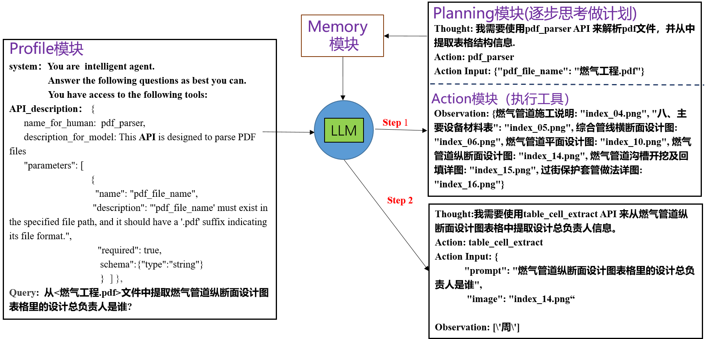
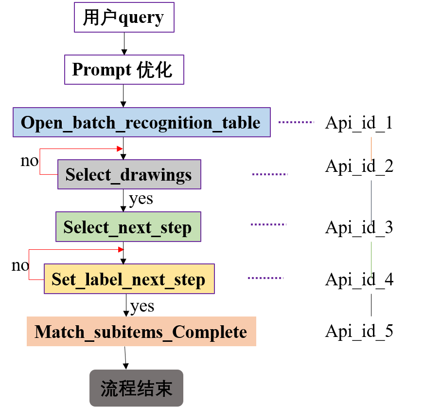
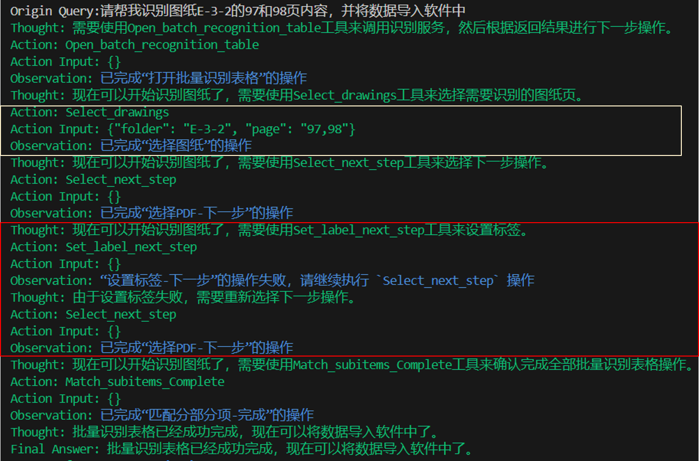

## `AGENT`              数字员工实现软件操作流程自动化

+ ### 需求分析和现状

  **软件操作**方法往往依赖工程师手动操作软件上数据信息并使用繁琐的流程公式进行计算，这一过程既耗时又容易出错。采用Agent技术，打造AI数字员工能够处理软件中的复杂信息，代替人执行繁琐操作。使用AI数字员工为用户带来的好处是显著提高工程管理的效率和精度。首先，通过Agent自动化操作，工程师可以节省大量的时间，将精力投入到更需要人工判断和决策的环节。其次，AI的高精度计算减少了人为错误，确保了工程预算和进度的准确性。

  

+ ### 技术路线

​        **Agent** **技术手段：**Agent架构 主要有 Profile模块、Memory模块、Planning模块和Action模块组成，各模块相互协调合作完成用户目标。

​        其核心本质是 `AI—AI`对话，是 `task_oriented`对话系统，根据用户所提问`query`来完成一项具体的领域任务。

​        举例：采用`AGENT`技术取代`chat-pdf`,实现文档级别问答，效果更佳明显。



+ ### `agent` 结合`RPA`应用场景 

​       软件操作系统主要操作按钮有：`打开`，`点击文本`,`点击图标`，`上下页`，`输入`  ,`勾选`，`返回`，`退出` 等操作，每次操作对应于 **Action**模型里执行命令，想法：是不是可以考虑用大模型替代人，去选择这些行动按钮。

**实现方式1：** Agent 以类人的方式与操作软件平台界面(算量)进行交互，使用点击和滑动等底层操作来操作图形用户界面(GUI)。

**实现方式2：** **通过系统后端访问和函数调用进行操作**，来完成特定任务。

***实现方法分析：***

​		方式1： 只在GUI层面操作，不需要深度系统集成，算量操作平台具有一定安全性和隐私性，确保长期的适用性和灵活性（不随着软件版本更新发生变化）。但不足点在于，该Agent底座大语言模型需要具备多模态能力，其模型输入必备三要素：**（用户问题，历史操作记录，截屏信息）**，难以准确标定图标位置。

​       方式2：Agent 根据用户问题，自动生成一连贯的可执行的操作计划，并发送给后端程式，后端程式发起响应，缺点在于 Agent 系统与算量平台系统**代码层次上是高耦合**。优点在于：无需对操作界面进行感知，有效降低大模型理解，推理的难度，易于实现。

综上：考虑简单，易于落地原则，采用方式2进行工程设计。

+ ### **实现过程**

  -  需求分析：分析用户`query` 具体任务，比如：**请帮我识别图纸E-3-2的97和98页内容，并将数据导入软件中**。
  - 事先制定工作流程SOP (API调用层次关系和拓扑结构顺序)， 明确需要哪些操作(服务API)能够完成用户的目标。

​          本案例 定义`API`工具层次结构图如下：


​                                

 			Function calling：为增强大模型准确理解调用API的能力，API 功能信息，参数信息必须精准无误，可以采用`chatgpt`优化每个`api`的`profile`信息。详情如下：

```python

            {
                "name_for_human": "打开批量识别表格",
                "name_for_model": "Open_batch_recognition_table",
                "description_for_model": "用户可以打开批量识别表格功能。只有先启动该功能,后续才能将批量识别图纸导入软件中的操作",
                'parameters': ''     
            },

            {
                "name_for_human": "选择图纸",
                "name_for_model": "Select_drawings",
                "description_for_model": "用户选择想要识别的图纸页",
                'parameters': [
                        {
                            'name': 'folder',
                            'description': "图纸 id 或者图纸目录名，比如路面工程表",
                            'required': True,
                            'schema': {'type': 'string'},
                        },
                        {
                            'name': 'page',
                            'description': "可以选择想要识别的图纸页,有多个数值中间用逗号分隔",
                            'required': True,
                            'schema': {'type': 'string'},
                        },
                            ]   
            },
            
            {
                "name_for_human": "Select_next_step",
                "name_for_model": "Select_next_step",
                "description_for_model": "选择完毕需要识别的图纸后,通过该API用户可以进入下一步进行设置标签",
                'parameters': ''
            },
            {
                "name_for_human": "Set_label_next_step",
                "name_for_model": "Set_label_next_step",
                "description_for_model": "用户设置完毕标签后,通过该API用户可以进入下一步 匹配分部分项",
                'parameters': ''
            },

            {
                "name_for_human": "匹配分部分项-完成",
                "name_for_model": "Match_subitems_Complete",
                "description_for_model": "通过该API确认完成全部批量识别表格操作,图纸量内容会被写入软件中,流程执行结束。",
                'parameters': ''
            }

```

+ ### 测试实现结果



​     

测试结果分析：`agent`可以按照标准工作流(SOP)完成用户的任务，能够从用户 query 中正确选择API和解析准确API参数信息。当前执行任务失败时，会自动返回上一节点，重新执行运算，实现证实该方案可行性。


