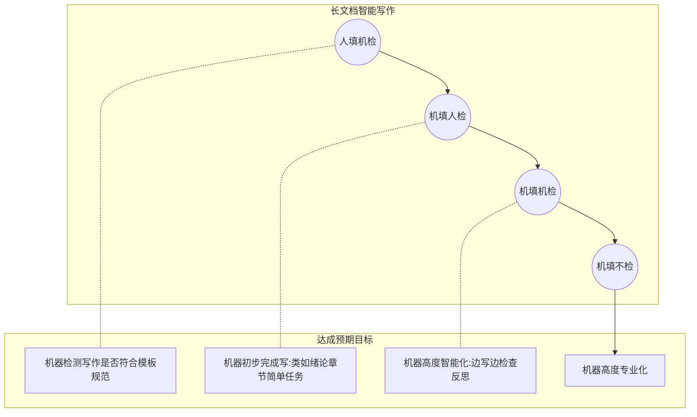

### **智能写作技术路线**

​       在大模型的现有能力框架内，其对于处理`长文档`级别的智能写作任务存在一定的局限性。针对这一问题，本文深入探讨了`长文档智能写作`这一应用场景，并在此基础上，提出了一套切实可行的技术解决方案。该方案旨在弥补大模型在长文档处理方面的不足，为从事智能写作的相关人员提供了一种新的思路和方法。通过采纳这一技术解决方案，有望在长文档智能写作领域取得显著成效，进一步提升写作效率和质量。

+ **人类写作工作流**

  在探讨如何撰写一篇 `高质量` 论文的过程中，我们可以以撰写学术论文为例来详细说明。

  以下常规写作流程：

  - **第一步：** 首先，研究者需从相关学术期刊下载相应的论文模板，以确保文档格式符合发表要求。
  - **第二步：** 接着，研究者在模板的基础上，开始填充内容，包括撰写摘要、构思章节标题、撰写各段落正文等，确保论文内容的完整性和逻辑性。
  - **第三步：** 完成初稿后，研究者将论文提交给评审专家或指导老师进行审查。
  - **第四步：** 根据评审专家或指导老师的反馈意见，研究者对论文内容进行修订和完善，重复第二步的过程，直至论文达到预期的质量标准。

  在 **人类执行任务的传统工作流模式** 中，涉及到 `研究者` 和 `评委` 两个关键角色。考虑到效率提升的可能性，我们探索利用**大模型AI**技术来部分替代这些角色，从而缩短写作流程。

  在 **人类执行任务的传统工作流模式** 中，在学术论文的撰写与评审过程中，评审专家的任务相对简洁，通常仅需几天时间即可完成，而研究者撰写一篇论文则可能需要数月。遵循从简单到复杂的自然原则，我们倾向于首先考虑让AI技术在智能写作领域扮演评审专家的角色，以此作为AI辅助学术工作的初步尝试。

  在技术层面上考虑**大模型解决任务**的能力，我们可以观察到：对于**生成高质量文本的任务**，大模型的处理复杂度高于其在**理解文本的任务**上的复杂度。

+ **AI 写作阶段**

  在我的理解中，实现`长文档智能写作`是一个从简至繁的渐进过程，它包含四个明确的阶段：首先是**人填机检**阶段，其次是**机填人检**阶段，然后是**机填机检**阶段，最终达到**机填不检**的阶段。这四个阶段共同构成了智能写作的发展路径。




------


+ **第一阶段 ： 人填机检**

  ***人填机检*** 的目的主要包括以下几点：

  1. **确保内容准确性**：人在填写内容时可能会出现错误，机检可以帮助发现并纠正这些错误，如拼写、语法、数据准确性等。
  2. **提升写作质量**：通过机器检查，可以评估文本的流畅性、一致性以及是否符合特定的写作风格和格式要求。
  3. **优化内容结构**：机器可以检查文档的结构是否符合逻辑和标准，比如章节标题的层级关系、段落间的连贯性等。
  4. **节省时间**：人工检查长文档是一项耗时的工作，机器辅助检查可以大幅缩短审核时间，提高效率。
  5. **提供反馈**：机器检查可以为撰写者提供即时的反馈，帮助其学习和改进写作技巧。
  6. **遵循规范**：对于需要遵循特定出版或学术规范的文档，机器检查可以确保文本符合这些要求。

  

  当用户导入模板时，该模板已预设了文档的结构和格式，其中模板中 **<|g_mask|>** 用作为标识**待填充内容或需核查的区域**。

  用户在指定区域输入具体文本信息后，系统将自动激活模型的自动校准功能，即时提供反馈和修订建议。

  当用户输入内容满足机器审查要求，机器会提示 ‘’**录入成功**‘’ 字样，并将**填充内容** 记录到**数据库**，用于 **人填机检** 第二阶段训练样本。

  **例如：**

  ###################

  **<|g_mask|>**  具体待填充的内容信息  **\<|g_mask|>**

  ###################

  + **在用户编写过程中**，用户根据**紫色**标识符指令书写(prompt)**，系统会自动实时检测该区域用户书写内容是否符合规范。这里我写的指令过于宽泛，实际用户 `prompt` 指定要精准，人类书写 基于该指令回复文本 **要聚焦**， 答复要 **非黑即白

  + **模板设计原则：** 从我们的素材库里检索。如果检索不到，用户自己按照《模板设计细则》要求，自己设置模板并上传。《模板设计细则》当然也是由我们来定规则。当上述两者条件无法达到要求时，请让用户**开通 VIP 服务权限** ，利用大模型本身固有能力，生成相对粗糙模板范本。

------


+ **第二阶段 ： 机填人检**

  在第一阶段生成的数据将作为第二阶段的训练数据，这引发了一个关键问题：如何更有效地利用这些**训练数据**进行模型的微调，以实现针对特定待填充区域的机器自动填写功能。

  微调模型时，我们依赖于问答数据对。以下是一种直观的方法来构建这些数据对：

  **目标（Target）：** 使用生产数据中用户实际填写的内容。

  **查询（Query）：**

  - **数据来源1：** 将特定待填充区域的整个章节段落直接作为查询内容。
  - **数据来源2：** 利用特定待填充区域的上文进行检索，选取与特定待填充区域 最相关的N个段落作为查询的补充信息。
  - **数据来源3：** 从外部数据库或语料库中进行Rag检索，以获取更广泛的上下文信息。
  - **指令：** 模板中预定义**prompt** ，上文**<|g_mask|>** 里的指令。

  通过这些数据来源，我们可以构建出用于微调模型的问答数据对，从而提高模型在特定待填充区域的自动填写能力。

  **数据构造模式如下：**

  | 问   | 答   | 上下文   |
  | ---- | ---- | -------- |
  | 指令 | 目标 | 数据来源 |

  

  如果在 **第一阶段** 没有收集到足够数据，或者有**一系列的标准文档**，但是没有收集到一系列**问答对数据**，该怎么处理呢？

  这可以采用一种`naive` 的方法： 自训练(**self-training**)

  原理很简单： 将标准文档 按章节 拆成 若干段落 **graph**，标记如下
  $$
  document = [graph_1 ;graph_2;...;graph_{i-1}; graph_i ; graph_{i+1};...;graph_n]
  $$
  

  根据$[graph_{i-1};graph_{i+1}]$  的上下文的段落间 关联性内容，推导出$graph_i$ 。

  

  此外，为了进一步提升写作效率和质量，可以整合使用其他功能插件，如**自动续写、文本优化、校对以及内容扩展**等功能，以实现更全面的写作辅助体验。

  ```mermaid
  flowchart TD
      subgraph AI支持插件 
  
          subgraph plugin One 收集材料
             A((联网搜索)) -.- B[(DB/KB数据库检索)]    
          end
  
          subgraph plugin Two  反馈机制
             C(反问机制) --> D(信息追加)  
             D --> C
          end    
          
          subgraph plugin Three 写作能力
             X(关键词/短语) --> E(续写) & H(扩写)--> F(润色)  
             H  --风格 -->G(改写)--> F(润色)  
          end     
      end 
  ```

  

  

  上述功能模块的提示词大致可以参考如下，由`指令` + `格式` 完成：

  ```python
  prompt: 
  """
  <content>{content}</content>
  请帮我继续扩展一些这段话的内容。
  注意：你应该先判断一下这句话是中文还是英文，如果是中文，请给我返回中文的内容，如果是英文，请给我返回英文内容，只需要返回内容即可，不需要告知我是中文还是英文。
  """
          
  ```

  当然，这一功能模块的性能可以通过**训练方法**或**迭代优化的方式**进行提升，从而提高输出的质量。挑战在于：在构建训练数据集的问答对时，关键是要有效地**利用上下文中的数据源信息**。换句话说，数据构造的方法直接影响到AI生成文本的质量。

  ------

  

+ **机填机检**：

  在这个阶段，我们实现了**AI 之间的交互与合作**，构建了所谓的**多智能体系统框架**。在这个框架中，一个智能体（AI）负责提出修改建议，而另一个智能体（AI）则根据这些建议执行相应的修改。通过多轮的互动交流，双方共同完成任务。

  + 目前已采用**多智能体框架(Metagpt)** 实现端到端的长文档生成。

    第一步：先做任务规划，做任务执行调度；(可以理解为 根据 论文标题 题目 **生成大纲信息**；即 AI 对 全局写作做整体规划)。当然大模型规划的大纲，用户不满意可以进一步人工修改。

    第二步：执行动作**(Action)**;  根据大纲的每一小章节的**小标题和写作向导、章节描述信息**，执行 `写` 动作，该动作可以结合外部工具，覆盖联网、外部文件检索功能；

    **结合以上两点：** 很容易以**自动化方式**生成初稿。 

    ```mermaid
    flowchart TD
        subgraph 供应商管理制度
           a(文档标题) --> A
           aa(关键词) -.可选.-> A
           A[配置大纲生成方式] 
           A --> B[AI智能生成大纲]
           A --> C[选择人工大纲模板-i]
           C --> D
           B --> D[配置知识库]
           D -.yes.-> E[关联知识库]
           D -.no.-> F[不关联知识库]
           E --> G((开始写作))
           F --> G((开始写作))
           G((开始写作)) --> H{{初稿}}
        end
    ```

    **终稿：**初稿的文章质量往往不能满足生产要求，因此，需要引入`机检` 机制，即在每个小节里的 `写` 的动作，**增加自评判、自改进功能。**

    ```mermaid
     flowchart LR 
       subgraph 机填机检
                G((开始写作)) -.-> H[初稿]
                H -.-> l[llm 按章节依次审核]
                l-.y.-> I[自批判] --> M[自改进]
                M --> l
                l -.n.->HH{{终稿}}
                
        end
    ```

     

  + **优点：能够产生符合写作格式的长文档； 缺点：内容上写的很肤浅，很发散，不能聚焦，或者用户输入信息不充足，不能满足生产要求。 **

------


+ **机填不检**：

  在**机填机检**的过程中，由于涉及AI之间的多轮交互，面临着内存和计算资源的限制。此外，AI之间的沟通可能会出现故障或短路，一旦某个AI角色发生故障，可能会引发连锁反应，最终导致整个任务无法顺利完成。

  理想的实现逻辑是采用**自动填充而无需检测**的模式，这意味着大型模型已经具备了充足的专业知识，并且用户提供的辅助资料也极为详尽。在满足这两个前提条件下，未来我们有望实现自动填充而无需后续检验的目标。

  


​              

​				

