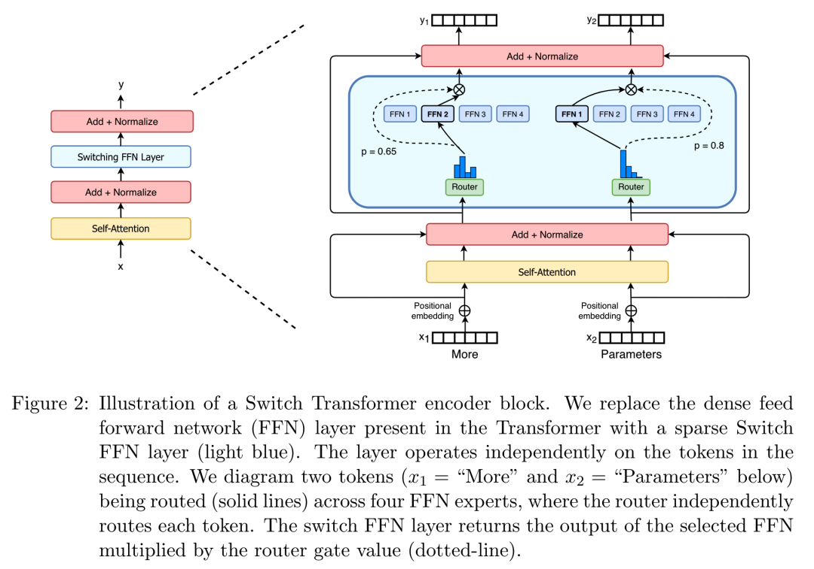

`MOE` 

+ `GShard: `**Scaling Giant Models with Conditional Computation and Automatic Sharding**

  + **模型设计：**

    

  + **特点:**

      (1)  **专家容量** expert capacity

    +  强制规定了每一个expert所负责处理的token数量有一个最大值，这个最大值就叫专家容量；（2N/E）

    （2）**分组分配** Local group dispatching

    + 给所有输入token分成了G组，不同的组并行处理，每个组相应地也把组内专家容量变成2N/EG。这样做相当于在前向推理时，把大的batch拆分成的 batch，每个小的batch就是一个group。**这样做的好处是通讯的时候只需要在每个group内进行就可以了，减少了通讯量。**而进行反向计算的时候这些group可以合起来一起用，相当于进行了gradient accumulation。 

    （3）**辅助损失函数** Auxiliary loss

    + 损失函数如下：
      $$
      l_{aux} = \frac{1}{E}\sum_{e=1}^{E} \frac{c_e}{S}\ m_e
      $$
       $	S$是token数， $E$是专家数， $c_e$是分配给第$e$ 个专家的token数， $m_e$是第$e$ 个expert在$S$ 个token中获得的平均权重;

    （4）**随机路由** Random routing

    + 如果top-1专家的权重很高，而第二个专家的权重如果较小，那很有可能只用第一个专家就足够解决问题了。

+ `Switch Transformer`: **Switch Transformers: Scaling to Trillion Parameter Models with Simple and Efficient Sparsity**

  +  **模型设计**

    

  + **特点：**

     (1)  **专家容量** expert capacity
    $$
    expert\ capacity = (\frac{tokens \ per \ batch}{numbers\ of \ experts}) · capacity \ factor.
    $$
     (2) **负载均衡损失**
    $$
    loss = a·N·\sum_{i-1}^{N}f_i·P_i
    $$
       $f_i$表示被分配到第 $i$个expert的token数
    $$
    f_i = \frac{1}{T}\sum_{x \in B}1\{argmax(p(x)) = i \}
    $$
     $P_i$表示整个batch每个token分配给第$i$ 个expert的概率的总和
    $$
    P_i = \frac{1}{T}\sum_{x\in B}p_i(x)
    $$
    负载损失函数设计的思路与上述`GShard` 完全一致，只不过系数不太相似。

  + **主要工作：**

    （1）MoE to dense：把训出来的效果较好的MoE模型蒸馏到dense模型，在压缩MoE模型99%的参数的情况下，效果还是比直接训练dense模型好。

    （2）训练和微调技术：

    - 首次使用bf16成功训练MoE模型：

      routing function内部使用单精度，其他部分使用半精度。

    - 更适合MoE结构的模型初始化

    - 增加的专家正则化，改善了稀疏模型的微调和多任务训练

  ​       （3）训练框架：结合数据、模型和专家并行性，训练了超过1T参数的MoE模型。

+ `ST-MoE`: **DESIGNING STABLE AND TRANSFERABLE SPARSE EXPERT MODELS**

  + 思想： 稳定训练

    1. 乘性操作对模型稳定性和效果的影响
       + GELU Gated Linear Units
       + RMSNorm
       + 增加dense层
       + 增加一个bias

       2. noise对模型稳定性和效果的影响

          给router的输入logits乘以一个在[1e-2, 1e2]之间的均匀随机变量来添加噪音。

    3. 限制激活值和梯度值对模型稳定性和效果的影响

       **提出新的损失**：`router z-loss`损失
       $$
       L_z(x) = \frac{1}{B} \sum_{i=1}^B(log \sum_{j=1}^{N}e_j^{(i)})^{2}
       $$
       $B$ 是token的数量， $E$是专家数， $x \in R^{B·N}$是router的输入。

    ​       `z-loss`会对进入router的较大的logits值进行惩罚，以达到尽量减少进入指数函数的较大误差的目的。

       4. 数据精度对训练效率和训练效果的影响

          

          