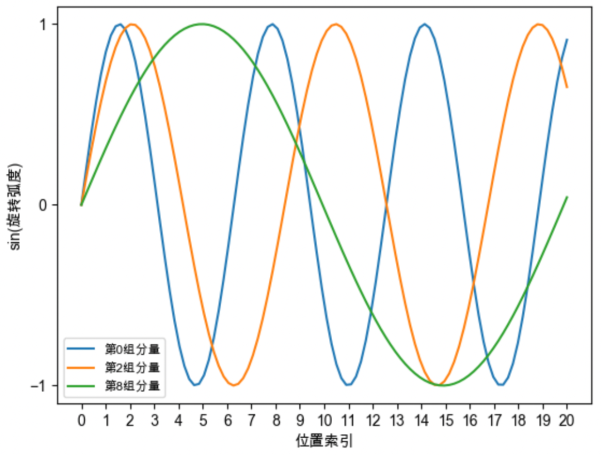

### **`RoPE `旋转位置编码**

+ 思想：**以绝对位置编码的方式实现相对位置编码**，`RoPE`位置编码通过将一个向量旋转某个角度，为其赋予位置信息。

  $q_m$ : 表示对词向量 $q$  添加绝对位置信息 $m$ ,  $q_m = f(q,m)$

  $k_n$:  表示对词向量 $k$ 添加绝对位置信息 $n$,    $k_n = f(k,n)$

  计算 $q_m,k_n$ 内积， 能够带有相对位置信息 $(m-n)$ . 或者说是将 $f(q,m)*f(k,n)$ 表示成关于$q,k,m-n$ 的函数 $g(q,k,m-n)$呢

  **建模目标**：
  $$
  q_{m}. k_n =f(q,m) .f(k,n) = g(q,k,m-n) \\
  q_0 = f(q,0) = q \\
  k_0 = f(k,0) = k
  $$
  **求解过程**：借助复数来针对该恒等式求解，复数的内积计算公式；
  $$
  q . k  = Re[qk^*]
  $$
  因此，需要满足下等式成立：
  $$
  q_{m}. k_n = Re[q_m .k_n^*] =  g(q,k,m-n)
  $$
  将$f,g$  将实部虚部 可转化 复指数形式表达：
  $$
  f(q,m) = R_f(q,m) e^{i\theta_f(q,m)} \\
  f(k,n) = R_f(k,n) e^{i\theta_f(k,n)} \\
  g(q,m,m-n) = R_g(q,k,m-n) e^{i\theta_g(q,k,m-n)}
  $$
  代入实部，虚部相同
  $$
  R_f(q,m) . R_f(k,n) =  R_g(q,k,m-n) \\
  \theta_f(q,m) - \theta_f(k,n) = \theta_g(q,k,m-n)
  $$
  代入特定值 $m =n$ 求解：
  $$
  R_f(q,m) . R_f(k,m) =  R_g(q,k,0) = R_f(q,0) . R_f(k,0) = ||q|| .||k||  \\
  \theta_f(q,m) - \theta_f(k,m) = \theta_g(q,k,0) = \theta_f(q,0) - \theta_f(k,0) = \theta(q) - \theta(k)
  $$
  ====>
  $$
  R_f(q,m)   = ||q||  \\
  R_f(k,m)   = ||k||  \\
  \theta_f(q,m) -\theta(q)  = \theta_f(k,m)   - \theta(k)
  $$
  因此： $\theta_f(q,m) -\theta(q) $ 是一个只与$m$ 有关，与$q$ 无关的向量，记作$\phi(m)$
  $$
  \theta_f(q,m) = \theta(q) + \phi(m)
  $$
  接着将 $n = m-1$ 代入，整理得：
  $$
  \phi(m) - \phi(m-1) = \theta_g(q,k,1) +\theta(k) -\theta(q)
  $$
  $\phi(m) $ 是等差数列，设右端为$\theta$ , 即 $\phi(m) = m \theta$

  **推导结论**：

   在原始向量空间上，作用个旋转矩阵即可，这意味着只需要将向量旋转某个角度，即可实现对该向量添加绝对位置信息，这就是旋转位置编码的由来。
  $$
  f(q,m) = R_m q = \left(
  \begin{array}{1}
  \cos m\theta & -\sin m\theta \\
  \sin  m\theta & \cos m\theta
  \end{array}
  \right)
  \left(
  \begin{array}{1}
  q_0 \\
  q_1 
  \end{array}
  \right)
  $$
  

  

  **只需要对向量进行旋转操作，即可对向量添加对应的位置信息，并且向量旋转具有周期性。**

  + 推广到多维度空间：**高维向量，两两一组，分别旋转**

    ​																		     

  + $\theta$ 的取值采用 Sinusoidal位置编码的设置， 即$\theta_{i} = base ^{-2i/d}$， 为了节省算力，采用以下形式：

    

+ 周期性：对于每组分量，它的旋转弧度随着位置索引的增加而线性增加。每组分量的旋转都具有周期性,越靠后的分组，它的旋转速度越慢,正弦函数的周期越大、频率越低。

  

  

+ 远程衰减性：

  远程衰减性（Distant Decay）是指位置编码应能捕获到序列中相隔较远的单词之间的关系，即相隔较远的单词之间的位置编码相似度应较低。这有助于模型更好地理解和区分序列中的词序关系。具备远程衰减性的位置编码可以使模型学习到更多的长距离依赖关系，从而提高模型的性能。

  

  规律： **base的不同取值会影响注意力远程衰减的程度。**当base大于500时，随着base的提升，远程衰减的程度会逐渐削弱。更大的base也将会使得注意力远程衰减的性质变弱，改变模型的注意力分布，导致模型的输出质量下降。但太小的base也会破坏注意力远程衰减的性质，例如base=10或100时，注意力分数不再随着相对位置的增大呈现出震荡下降的趋势。更极端的情况下，当base=1时，将完全失去远程衰减特性。

​	 

+ **代码**

  ```python
  class RotaryEmbedding(torch.nn.Module):
      def __init__(self,dim,base = 10000)
          self.base = base
          self.dim = dim
          # 初始化 \theta
          self.inv_freq = 1.0 / (base ** (torch.arange(0,dim,2).float() /dim))
      def forward(max_seq_len):
          seq = torch.arange(max_seq_len, device = self.inv_freq.devices)
          # 计算 m * \theta
          freqs = torch.outer(seq.type_as(self.inv_freq), self.inv_freq)
          # 拼凑成两份，即 m \theta_0, m \theta_1, m \theta_d/2-1, m \theta_0, m \theta_1, m \theta_d/2-1
          # 保证旋转向量 与 q, k 维度保持一致性。
          emb = torch.cat((freqs,freqs),dim = -1)
          cos, sin = emb.cos(), emb.sin()
          # 将旋转矩阵保留下来。
          self._rotary_pos_emb_cache = [cos, sin]
  ```

  怎么作用在$k,v$:

  ```python
  def apply_rotary_pos_emb(h,freqs):
      cos,sin = freq
      return  h * cos + rotate_half(h) * sin
  def rotate_half(h):
      x = rearrange(x, "... (j d) -> ... j d", j=2)
      x1, x2 = x.unbind(dim=-2)
      return torch.cat((-x2, x1), dim=-1)
  """
  和论文中实现顺序不大一致，大致猜测向量q中元素做交换，不会改变结果。
  """
  ```

  

+ **外推性**：

  策略： **通过减小`RoPE`的旋转弧度来进行长度扩展**

  + **Position Interpolation**

    原因：模型在训练时，只见过$[0,(L-1)\theta_{i}]$ 范围内的旋转弧度，未见过大于$(L-1)\theta_{i}$ 的旋转弧度，所以当推理长度大于$L$ 时，模型难以理解新的旋转弧度，无法正确注入位置信息，导致模型性能下降。

    Position Interpolation的做法简单且直观：**缩小每个位置的旋转弧度，让向量旋转得慢一些，每个位置的旋转弧度变为原来的 ，长度扩大几倍，则旋转弧度缩小几倍。**
    $$
    \frac{mL\theta_{i}}{L^{'}} = \frac{mL}{L^{'}} base^{-2i/d}
    $$

  + **NTK-Aware Interpolation**

    `Position Interpolation`对于向量的所有分组不加区分地缩小旋转弧度，降低旋转速度，会导致模型的高频信息缺失，从而影响模型的性能。而`NTK-Aware`插值认为高频信息对于神经网络非常重要,  位置越靠前的向量分组，旋转速度越快，频率越高，更希望保留这些高频信息。
    $$
    m\theta_{i} = m(base* \alpha)^{-2i/d}
    $$
    保留高频信息；高频分量旋转速度降幅低，低频分量旋转速度降幅高；在**高频部分进行外推，低频部分进行内插**。

  + **Dynamic NTK Interpolation**

    当超出训练长度时，上述插值方法都比原模型直接外推的效果更好，但是它们都有一个共同的缺点，在训练长度内，推理表现都比原模型差。Dynamic NTK Interpolation是一种动态插值的方法，思路也很简单：推理长度小于等于训练长度时，不进行插值；推理长度大于训练长度时，每一步都通过NTK-Aware Interpolation动态放大base。
    $$
    \alpha = (\frac{l}{L})^{d/(d-2)} 
    $$
     $l$表示当前的序列长度， $L$表示模型训练长度，

+ **其他位置编码**

  + **ALIBI**：

    种类： 基于**Attention Bias**的位置编码，只是在**Softmax**之前，将**Attention**的计算从$q_m^Tk_n$改为

  $$
  q_m^Tk_n - \lambda |m-n|
  $$

  ​       缺点： 按理说模型就无法区分“左”和“右”，只能识别相对距离的远近，显然是无法准确识别位置信息的。

  + **Sandwich：**

    种类：**Sandwich通过拼接的方式补充绝对位置信息，其Attention结果则相当于相对位置编码。**
    $$
    q_m^Tk_n + \lambda p_m^Tp_n
    $$
    $p_m,p_n$ 是`Sinusoidal`位置编码,$ p_m^Tp_n$ 整体并非严格的单调，而是振荡下降。

  + **Transformer-XL的相对位置编码**

    种类：**把相对位置编码加入到self-attention中的思想**, 将上述公式进行惩罚展开：
    $$
    Q^TK \\
    A_{i,j}^{abs}=(W_q(E_{{x_i}}+ U_i))^T(W_K(E_{{x_j}}+ U_j)) \\
    A_{i,j}^{abs}= E_{x_i}^TW_q^TW_kE_{x_j} + E_{x_i}^TW_q^TW_kU_{j} + U_{i}^TW_q^TW_kE_{x_j} + U_{i}^TW_q^TW_kU_{j}
    $$
     思想： **learnable embeddings -> fixed embeddings with learnable transformations**
    $$
    A_{i,j}^{rel}= E_{x_i}^TW_q^TW_{k,E}E_{x_j} + E_{x_i}^TW_q^TW_{k,R}R_{i-j} + u^TW_{k,E}E_{x_j} + v^TW_{k,R}R_{i-j}
    $$
    **变化1：**$W_k$ 被拆分成立 $𝑊_{𝑘,E}$ $𝑊_{𝑘,R}$ ,  输入序列和位置编码不再共享权值。

    **变化2：** 绝对位置编码$U_j$ 变成相对位置编码$R_{i-j}$, 其中$R$ 是 Transformer中采用的不需要学习的`sinsoid`编码矩阵.

    **变化3：** 引入两个新的可学参数$u$ $v$ 来替换query向量$U_i^TW_q^T$, 无论查询位置如何，对不同单词的注意偏差都应该保持不变。

    总结：绝对位置可以表示为 基准点 * 相对位置矩阵, 基准点设置可学参数，更好表达不同位置同一个`query`。 

    

    

    

  

​		 	
